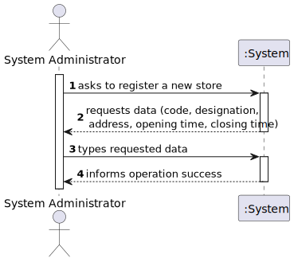
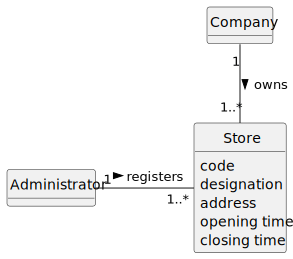
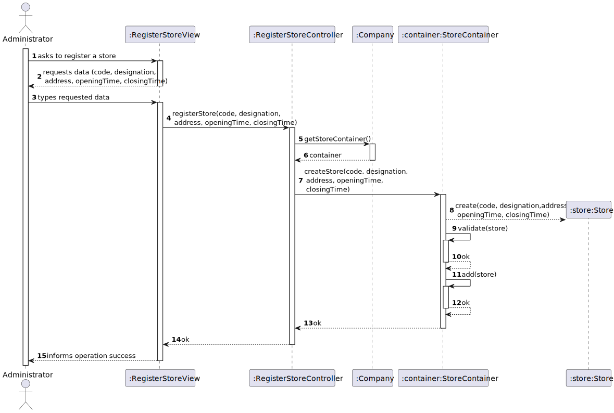
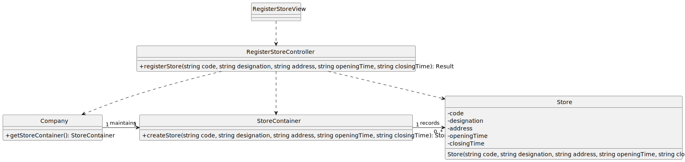

# US 10 - Register a Store

## 1. Requirements Engineering

### 1.1. User Story Description

As System Administrator, I want to register a new store.

### 1.2. Customer Specifications and Clarifications

**From the specifications document:**

>No specifications were found.

**From the client clarifications:**

> **Question:** ?
>
> **Answer:** *

### 1.3. Acceptance Criteria

- AC01-1: The store code must be unique and have five alphanumeric characters.
- AC01-2: Opening and closing times should be entered in the format hh:mm.

### 1.4. Found out Dependencies

- No dependencies were found.

### 1.5. Input and Output Data

**Input Data:**

- Typed data:
  - a code
  - a designation
  - an address
  - an opening time
  - a closing time

- Selected data:
  - n/a

**Output Data:**

- (In)success of the operation

### 1.6. System Sequence Diagram (SSD)

### 1.7. Other Relevant Remarks

- Nothing to report for now.

## 2. OO Analysis

### 2.1. Relevant Domain Model Excerpt

### 2.2. Other Remarks

- n/a

## 3. Design - User Story Realization

### 3.1. Rationale

| Interaction ID | Question: Which class is responsible for...   | Answer                  | Justification (with patterns)                                                                                                  |
|:---------------|:----------------------------------------------|:------------------------|:-------------------------------------------------------------------------------------------------------------------------------|
| Step 1  		     | 	... interacting with the actor?              | RegisterStoreView       | Pure Fabrication: there is no reason to assign this responsibility to any existing class in the Domain Model.                  |
| 			  		        | 	... coordinating the US?                     | RegisterStoreController | Controller                                                                                                                     |
| 			  		        | 	... instantiating a new Store?               | Company                 | Creator (Rule 1): Company contains or aggregates instances of Store                                                            |
| 			  		        | 	                                             | StoreContainer          | By applying High Cohesion (HC) + Low Coupling (LC) on class Company, it delegates the responsibility on StoreContainer.        |
| 			  		        | ... knowing the StoreContainer?               | Company                 | IE: Company owns all the stores, therefore it knows all the registered stores.                                                 |
| Step 2  		     | 	... requesting data?				                     | RegisterStoreView       | IE: is responsible for user interactions.                                                                                      |
| Step 3  		     | 	... saving the inputted data?                | Store                   | IE: Store class represents a single store, and it holds the data related to that store.                                        | 
| 		             | 	... validating all data (local validation)?  | Store                   | IE: Just like before, it holds the data related to that store so it should validate it on its own (Tell, Don't Ask principle). | 
| 			  	         | 	... validating all data (global validation)? | StoreContainer          | IE: knows all existing stores.                                                                                                 |
| Step 4  		     | 	... informing operation success?             | RegisterStoreView       | IE: is responsible for user interactions.                                                                                      | | 

### Systematization

According to the taken rationale, the conceptual classes promoted to software classes are:

- Company
- Store

Other software classes (i.e. Pure Fabrication) identified:

- RegisterStoreView
- RegisterStoreController
- StoreContainer

### 3.2. Sequence Diagram (SD)

### 3.3. Class Diagram (CD)

**Note: private methods were omitted.**

