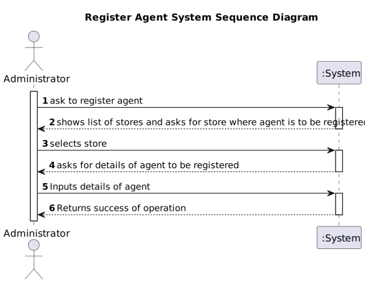
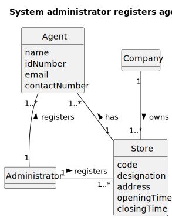
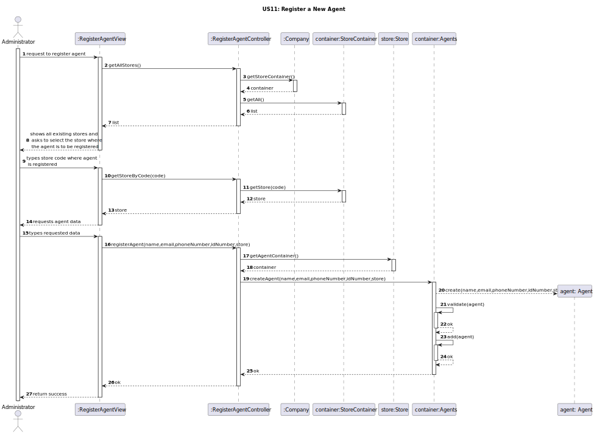
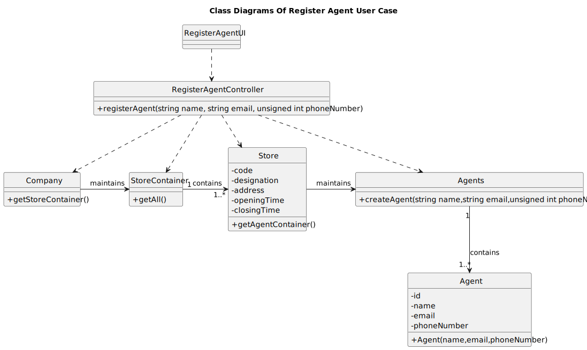

# US 02 - System administrator registers agent

## 1. Requirements Engineering

_In this section, it is suggested to capture the User Story description and the requirements specification as provided by the client, as well as any further clarifications on it. It is also suggested to capture the client acceptance criteria and existing dependencies to other requirements. Finally, identify the involved input and output data and depict an Actor-System interaction in order to fulfill the requirements._

### 1.1. User Story Description

As System Administrator, I want to register a new agent.

### 1.2. Customer Specifications and Clarifications 

When registering an agent, the system administrator must specify the agent's name, the citizen’s card number, the email
address, the contact telephone number and the agency to which the agent is assigned.

### 1.3. Acceptance Criteria

* AC02-1: The Administrator should choose the store where the agent works (or will work) from a
list of existing stores.
* AC02-2: Providing the Citizen Card Number is optional

### 1.4. Found out Dependencies

There is a dependency with [US10](../US10.md), since a store must previously be registered before registering an agent.

### 1.5 Input and Output Data

**Input Data:**

- Typed data:
    - a name
    - an email
    - a phone number

- Selected data:
    - the store where the agent works

**Output Data:**

- The list of stores in the company
- (In)success of the operation

### 1.6. System Sequence Diagram (SSD)

### 1.7 Other Relevant Remarks

n/a

## 2. OO Analysis

### 2.1. Relevant Domain Model Excerpt 

### 2.2. Other Remarks

n/a

## 3. Design - User Story Realization 

### 3.1. Rationale

**The rationale grounds on the SSD interactions and the identified input/output data.**

| Interaction ID | Question: Which class is responsible for... | Answer                  | Justification (with patterns)                                                                                           |
|:---------------|:--------------------------------------------|:------------------------|:------------------------------------------------------------------------------------------------------------------------|
| Step 1  		     | 		... interacting with the actor?					      | RegisterAgentView       | Pure Fabrication: there is no reason to assign this responsibility to any existing class in the Domain Model.           |
| 		             | 			... coordinating the US?				             | RegisterAgentController | Controller: Manages the interactions between the view and model classes (Company, StoreContainer, etc.).                |
| 		             | 			.. knowing the StoreContainer?				       | Company                 | IE: Company knows the StoreContainer                                                                                    |
| 		             | 			... listing all Stores?				              | StoreContainer          | By applying High Cohesion (HC) + Low Coupling (LC) on class Company, it delegates the responsibility on StoreContainer. |
| Step 2         | 			... knowing the Stores?				              | StoreContainer          | IE: StoreContainer knows the Store                                                                                      |
|                | 				... requesting data?				                | RegisterAgentView       | IE: is responsible for user interactions.                                                                               |
| Step 3         | 					.. knowing the Agents container?		     | Store                   | IE: Store knows the AgentContainer to which it is delegating some responsibilities.                                     |              
| 		             | 					..creating an agent		                  | Agents                  | Creator: Follows the 1st rule: Agents contains multiple instances of Agent.                                             |   
| 		             | 					..validating an agent		                | Agents                  | IE: knows/records all existing agents.                                                                                  |               
| 		             | 					... informing operation success?	      | RegisterAgentView       | IE: is responsible for user interactions.                                                                               |              

### Systematization ##

According to the taken rationale, the conceptual classes promoted to software classes are:

- Company
- Store
- Agent

Other software classes (i.e. Pure Fabrication) identified:

- RegisterAgentUI
- RegisterAgentController
- StoreContainer
- Agents

### 3.2. Sequence Diagram (SD)

_In this section, it is suggested to present an UML dynamic view representing the sequence of interactions between software objects that allows to fulfill the requirements._

### 3.3. Class Diagram (CD)

_In this section, it is suggested to present an UML static view representing the main related software classes that are involved in fulfilling the requirements as well as their relations, attributes and methods._

## 4. Tests 

_In this section, it is suggested to systematize how the tests were designed to allow a correct measurement of requirements fulfilling._

**_DO NOT COPY ALL DEVELOPED TESTS HERE_**

**Test 1:** Check that it is not possible to create an instance of the Example class with empty values. 

    class ExampleFixture : public ::testing::Test {
        TEST_F(ExampleFixture, CreateWithEmptyCode){
            EXPECT_THROW(new Example(L"",L"Example One"),std::invalid_argument);
        }
    }

_It is also recommended organizing this content by subsections._ 

## 5. Integration and Demo 

_In this section, it is suggested to describe the efforts made to integrate this functionality with the other features of the system._

## 6. Observations

_In this section, it is suggested to present a critical perspective on the developed work, pointing, for example, to other alternatives and or future related work._