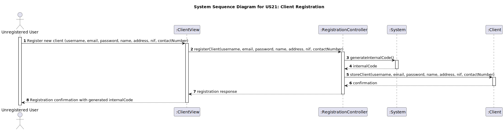
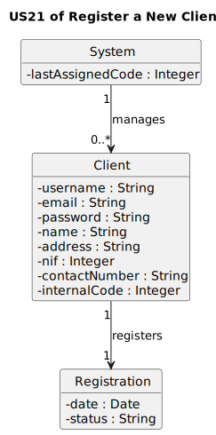
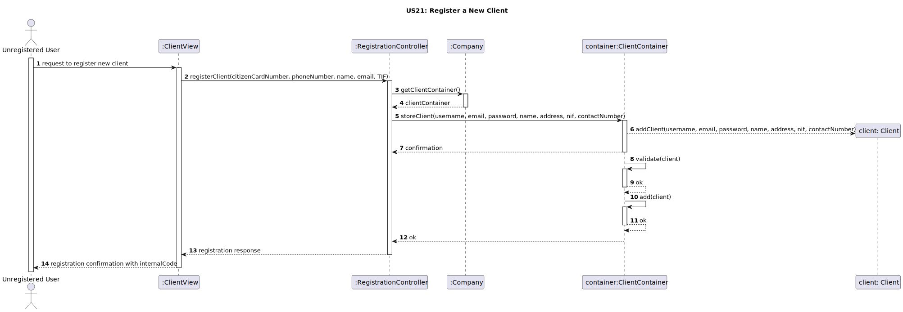
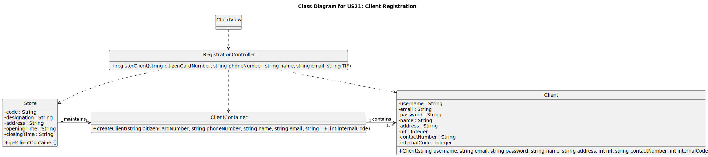

# US 21 - Register a New Client

## 1. Requirements Engineering

_In this section, it is suggested to capture the User Story description and the requirements specification as provided by the client, as well as any further clarifications on it. It is also suggested to capture the client acceptance criteria and existing dependencies to other requirements. Finally, identify the involved input and output data and depict an Actor-System interaction in order to fulfill the requirements._

### 1.1. User Story Description

_As an unregistered user, I want to register a new client so that I can create an account in the system._

### 1.2. Customer Specifications and Clarifications 

_The Citizen Card Number and the phone number must be unique for each client.
The Internal Code is a numeric code that starts at 1 and is generated sequentially._

### 1.3. Acceptance Criteria

_Insert here the client acceptance criteria._

### 1.4. Found out Dependencies

_Identify here any found out dependency to other US and/or requirements._

### 1.5 Input and Output Data

_Identity here the data to be inputted by the system actor as well as the output data that the system has/needs to present in order to properly support the actor actions. Regarding the inputted data, it is suggested to distinguish between typed data and selected data (e.g. from a list)._

### 1.6. System Sequence Diagram (SSD)

_Insert here a SSD depicting the envisioned Actor-System interactions and throughout which data is inputted and outputted to fulfill the requirements. All interactions must be numbered._

### 1.7 Other Relevant Remarks

_Use this section to capture other relevant information that is related with this US such as:  
&nbsp; &nbsp; (i) special requirements;  
&nbsp; &nbsp; (ii) data and/or technology variations;  
&nbsp; &nbsp; (iii) how often this US is held._

## 2. OO Analysis

### 2.1. Relevant Domain Model Excerpt 

_In this section, it is suggested to present an excerpt of the Domain Model (DM) that is seen as relevant to fulfill the requirements._

### 2.2. Other Remarks

_Use this section to capture some additional notes/remarks that must be taken into consideration in the design activity. In some cases, it might be useful to add other analysis artifacts (e.g. activity or state diagrams)._

## 3. Design - User Story Realization 

### 3.1. Rationale

**The rationale grounds on the SSD interactions and the identified input/output data.**

| Interaction ID | Question: Which class is responsible for...                          | Answer                   | Justification (with patterns)                                                                                                                                                                                                                 |
|:---------------|:---------------------------------------------------------------------|:-------------------------|:----------------------------------------------------------------------------------------------------------------------------------------------------------------------------------------------------------------------------------------------|
| Step 1| ...the user initiating the registration process?                     | `ClientView`             | The `User` interacts with `ClientView` to request registration, as shown by `User -> View: request to register new client`.                                                                                                                   |
| Step 2| ...handling the registration request and initiating further actions? | `RegistrationController` | `ClientView` calls `RegistrationController` with the `registerClient` method to process the registration (`View -> Ctrl: registerClient(citizenCardNumber, phoneNumber, name, email, TIF)`).                                                  |
| Step 3| ...knowing the client container?                                     | `Company`                | The `RegistrationController` requests the `clientContainer` from the `Company`, which is responsible for managing clients (`Ctrl -> Admin: getClientContainer()`).                                                                            |
| Step 4| ...generating a unique internal code for the client?                 | `Client`                 | The `Client` class is responsible for generating a unique internal code incrementally as it adds new clients (`clientContainer --> Client **: addClient(citizenCardNumber, phoneNumber, name, email, TIF, internalCode)`).                    |
| Step 5| ...storing the client information?                                   | `ClientContainer`        | The `RegistrationController` stores the new client data in `ClientContainer` using `Ctrl -> clientContainer: storeClient(...)`, and `ClientContainer` stores the data internally.                                                             |
| Step 6| ...sending the registration response back to the user?               | `ClientView`             | After the registration is confirmed, the `RegistrationController` sends a response to `ClientView`, which then displays the confirmation to the user (`Ctrl --> View: registration response` and `View --> User: registration confirmation`). |              

### Systematization ##

According to the taken rationale, the conceptual classes promoted to software classes are:

- **Client**
- - **Company**

Other software classes (i.e. Pure Fabrication) identified:

- **`ClientView`**
- **`RegistrationController`**
- **`ClientContainer`**

### 3.2. Sequence Diagram (SD)

_In this section, it is suggested to present an UML dynamic view representing the sequence of interactions between software objects that allows to fulfill the requirements._

### 3.3. Class Diagram (CD)

_In this section, it is suggested to present an UML static view representing the main related software classes that are involved in fulfilling the requirements as well as their relations, attributes and methods._

## 4. Tests 

_In this section, it is suggested to systematize how the tests were designed to allow a correct measurement of requirements fulfilling._

**_DO NOT COPY ALL DEVELOPED TESTS HERE_**

**Test 1:** Check that it is not possible to create an instance of the Example class with empty values. 

    class ExampleFixture : public ::testing::Test {
        TEST_F(ExampleFixture, CreateWithEmptyCode){
            EXPECT_THROW(new Example(L"",L"Example One"),std::invalid_argument);
        }
    }

_It is also recommended organizing this content by subsections._ 

## 5. Integration and Demo 

_In this section, it is suggested to describe the efforts made to integrate this functionality with the other features of the system._

## 6. Observations

_In this section, it is suggested to present a critical perspective on the developed work, pointing, for example, to other alternatives and or future related work._