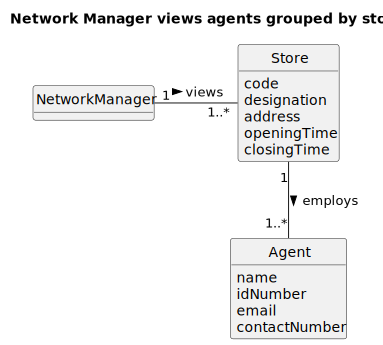
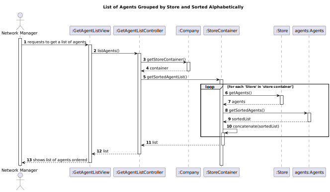
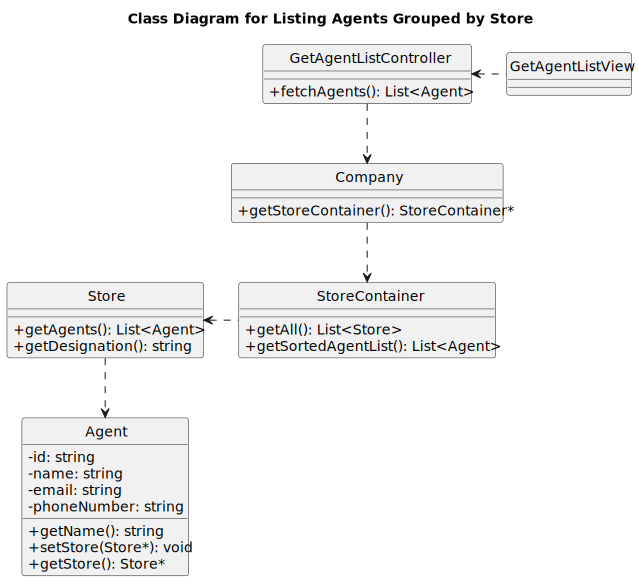

# US51 - Retrieve List of Agents

## 1. Requirements Engineering

### 1.1. User Story Description

As a **Network Manager**, I want to retrieve a list of all agents so that I can view the organization of agents by store.

### 1.2. Customer Specifications and Clarifications 

**From the specifications document:**

>No specifications were found.

**From the client clarifications:**

> **Question:** Can agents be listed from multiple stores, or is it a single store at a time?
> 
> **Answer:** The system must display agents from all stores, grouped by store, with agents listed alphabetically within each store.

> **Question:** Should the list of agents be editable or just viewable?
>
> **Answer:** The list of agents is only viewable and not editable by the Network Manager.

### 1.3. Acceptance Criteria

- **AC51-1:** Agents should be grouped by store, with each group displayed in alphabetical order by agent name.

## 1.4. Found out Dependencies

**Dependency with Store Data:** The functionality relies on store data to organize the agents.

**Interaction with Agent Registration (US11):** It depends on the registered agent data, as per the agent registration feature (US11), ensuring that all necessary agent information is available for listing.

**Dependency with Store Registration (US10):** The functionality of listing agents also depends on US10, since stores must be registered beforehand for agents to be organized and listed by store.

### 1.5 Input and Output Data

- **Input Data:** Selection of the “View Agents List” option by the Network Manager.
- **Output Data:** A structured list of agents, grouped by store and sorted alphabetically by agent name.

### 1.6. System Sequence Diagram (SSD)

The SSD illustrates interactions between the Network Manager and the system, showing data retrieval and display steps.

### 1.7 Other Relevant Remarks

- **Frequency:** This feature is likely to be accessed frequently for administrative purposes.
- **Performance Constraint:** Must conform to the specified 3-second response time for UI interactions.

## 2. OO Analysis

### 2.1. Relevant Domain Model Excerpt 

### 2.2. Other Remarks

- n/a

## 3. Design - User Story Realization

## 3. Design - User Story Realization

### 3.1. Rationale

| **Interaction ID** | **Question: Which class is responsible for...**                   | **Answer**                   | **Justification (with patterns)**                                                                                                                       |
|--------------------|-------------------------------------------------------------------|------------------------------|---------------------------------------------------------------------------------------------------------------------------------------------------------|
| **Step 1**         | ... interacting with the actor?                                  | **GetAgentListView**          | **Pure Fabrication**: The interaction with the user is managed by **GetAgentListView**, a user interface class that doesn't directly exist in the domain model. |
|                    | ... coordinating the operation flow?                              | **GetAgentListController**    | **Controller**: The **GetAgentListController** is responsible for coordinating the operation between **GetAgentListView** and the **StoreContainer**. |
|                    | ... requesting the list of agents?                                | **GetAgentListController**    | **Creator (Rule 1)**: The **GetAgentListController** requests the sorted agent list from the **StoreContainer**. |
|                    | ... retrieving the list of agents?                                | **StoreContainer**            | **High Cohesion + Low Coupling**: The **StoreContainer** manages the stores and provides access to the sorted list of agents. |
|                    | ... retrieving the agents from each store?                        | **Store**                     | **IE**: The **Store** retrieves agents associated with it through the `getAgents()` method. |
| **Step 2**         | ... requesting the data (agents)?                                 | **GetAgentListController**    | **IE**: The **GetAgentListController** interacts with the **Company** to retrieve the **StoreContainer**, and subsequently requests agents. |
| **Step 3**         | ... displaying the list of agents?                                | **GetAgentListView**          | **IE**: The **GetAgentListView** displays the agents grouped by store and sorted by name. |
|                    | ... validating data locally (e.g., checking format)?              | **Agent**                     | **IE**: The **Agent** validates its own data, ensuring that the name is correct and properly formatted. |
|                    | ... validating data globally (e.g., checking for duplicates)?     | **StoreContainer**            | **IE**: The **StoreContainer** ensures data integrity and eliminates duplicates while managing the agents. |
| **Step 4**         | ... informing about the success of the operation (displaying the list)? | **GetAgentListView**          | **IE**: The **GetAgentListView** informs the user about the success or failure of displaying the data. |

### Systematization

According to the rationale, the conceptual classes promoted to software classes are:

- **StoreContainer**
- **Store**
- **Agent**

Other software classes (i.e., Pure Fabrication) identified:

- **GetAgentListView**
- **GetAgentListController**
- **Company**

### 3.2. Sequence Diagram (SD)

### 3.3. Class Diagram (CD)

**Note: private methods were omitted.**