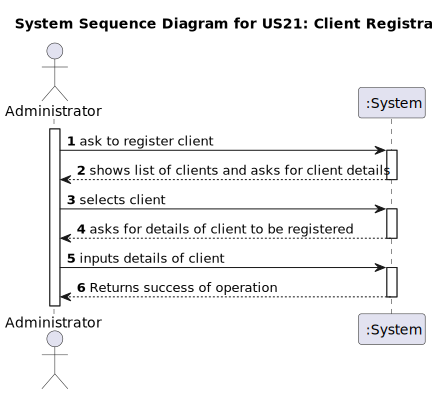
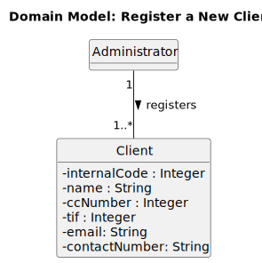
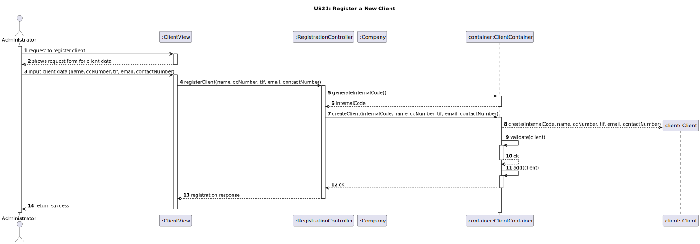
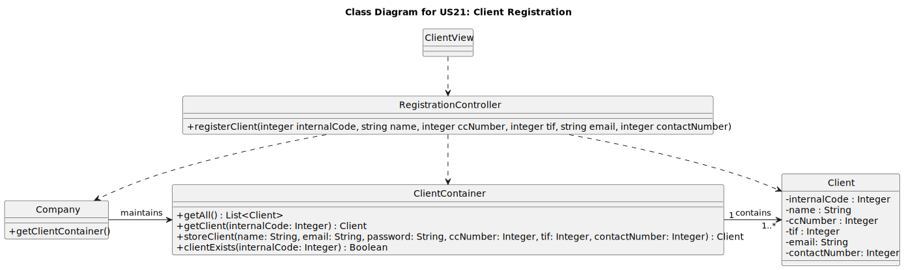

# US 21 - Register a New Client

## 1. Requirements Engineering

_In this section, it is suggested to capture the User Story description and the requirements specification as provided by the client, as well as any further clarifications on it. It is also suggested to capture the client acceptance criteria and existing dependencies to other requirements. Finally, identify the involved input and output data and depict an Actor-System interaction in order to fulfill the requirements._

### 1.1. User Story Description

_As an unregistered user, I want to register a new client so that I can create an account in the system._

### 1.2. Customer Specifications and Clarifications 

The unregistered user must provide the name, the citizen’s card number, the tax identification number (TIF), the email address and the contact
telephone number. Additionally, an internal code is automatically assigned.

### 1.3. Acceptance Criteria

* AC21-1: The Citizen Card Number and the phone number must be unique for each client.
* AC21-2: The Internal Code is a numeric code that starts at 1 and is generated sequentially.

### 1.4. Found out Dependencies

_Identify here any found out dependency to other US and/or requirements._

### 1.5 Input and Output Data

**Input Data:**

- Typed data:
    - name
    - citizen card number
    - tax identification number (TIF)
    - email address
    - contact telephone number

- Selected data:
    - 

**Output Data:**

- (In)success of the operation
- Internal code assigned sequentially

### 1.6. System Sequence Diagram (SSD)

_Insert here a SSD depicting the envisioned Actor-System interactions and throughout which data is inputted and outputted to fulfill the requirements. All interactions must be numbered._

### 1.7 Other Relevant Remarks

_Use this section to capture other relevant information that is related with this US such as:  
&nbsp; &nbsp; (i) special requirements;  
&nbsp; &nbsp; (ii) data and/or technology variations;  
&nbsp; &nbsp; (iii) how often this US is held._

## 2. OO Analysis

### 2.1. Relevant Domain Model Excerpt 

_In this section, it is suggested to present an excerpt of the Domain Model (DM) that is seen as relevant to fulfill the requirements._

### 2.2. Other Remarks

_Use this section to capture some additional notes/remarks that must be taken into consideration in the design activity. In some cases, it might be useful to add other analysis artifacts (e.g. activity or state diagrams)._

## 3. Design - User Story Realization 

### 3.1. Rationale

**The rationale grounds on the SSD interactions and the identified input/output data.**

| Interaction ID | Question: Which class is responsible for...                          | Answer                   | Justification (with patterns)                                                                                                                                                                |
|:---------------|:---------------------------------------------------------------------|:-------------------------|:---------------------------------------------------------------------------------------------------------------------------------------------------------------------------------------------|
| Step 1| ...the user initiating the registration process?                     | `ClientView`             | **Controller**: `ClientView` acts as the intermediary between the user and the system, handling the initial interaction and forwarding the registration request to `RegistrationController`. |
| Step 2| ...handling the registration request and initiating further actions? | `RegistrationController` | **Controller**: `RegistrationController` is the central point for processing the registration logic, ensuring separation of UI `ClientView` and domain ClientContainer` responsibilities.    |
| Step 3| ...managing client storage?                                          | `ClientContainer`        | **Creator**: `RegistrationController` delegates client creation and storage to `ClientContainer`, which is responsible for managing `Client` objects and their lifecycle.                    |
| Step 4| ...generating a unique internal code for the client?                 | `Client`                 | **Information Expert**: The `Client class owns the data required to generate a unique internal code (NUMBER), making it the logical place for this responsibility.                           |
| Step 5| ...storing the client information?                                   | `ClientContainer`        | **High Cohesion**: `ClientContainer` specializes in managing `Client objects, ensuring that related responsibilities (e.g., validation, storage) are handled within a single cohesive class. |
| Step 6| ...sending the registration response back to the user?               | `ClientView`             | **Controller**: `RegistrationController` sends the result of the registration process to `ClientView`, which is responsible for presenting the response to the user.                         |              

### Systematization ##

According to the taken rationale, the conceptual classes promoted to software classes are:

- Class1
- Class2
- Class3

Other software classes (i.e. Pure Fabrication) identified:

- xxxxView
- xxxxController

### 3.2. Sequence Diagram (SD)

_In this section, it is suggested to present an UML dynamic view representing the sequence of interactions between software objects that allows to fulfill the requirements._

### 3.3. Class Diagram (CD)

_In this section, it is suggested to present an UML static view representing the main related software classes that are involved in fulfilling the requirements as well as their relations, attributes and methods._

## 4. Tests 

_In this section, it is suggested to systematize how the tests were designed to allow a correct measurement of requirements fulfilling._

**_DO NOT COPY ALL DEVELOPED TESTS HERE_**

**Test 1:** Check that it is not possible to create an instance of the Example class with empty values. 

    class ExampleFixture : public ::testing::Test {
        TEST_F(ExampleFixture, CreateWithEmptyCode){
            EXPECT_THROW(new Example(L"",L"Example One"),std::invalid_argument);
        }
    }

_It is also recommended organizing this content by subsections._ 

## 5. Integration and Demo 

_In this section, it is suggested to describe the efforts made to integrate this functionality with the other features of the system._

## 6. Observations

_In this section, it is suggested to present a critical perspective on the developed work, pointing, for example, to other alternatives and or future related work._