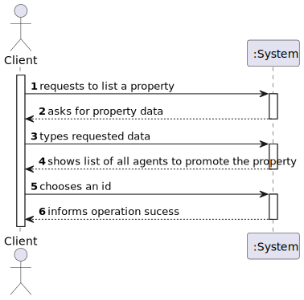
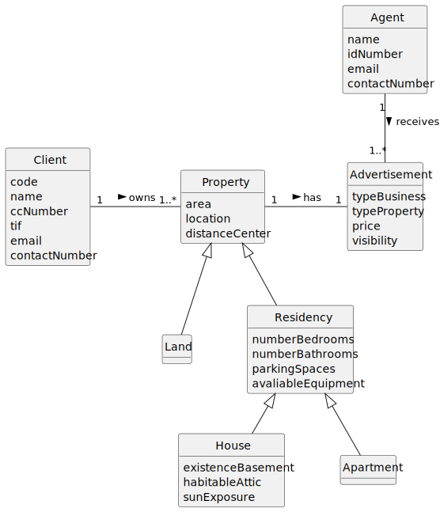
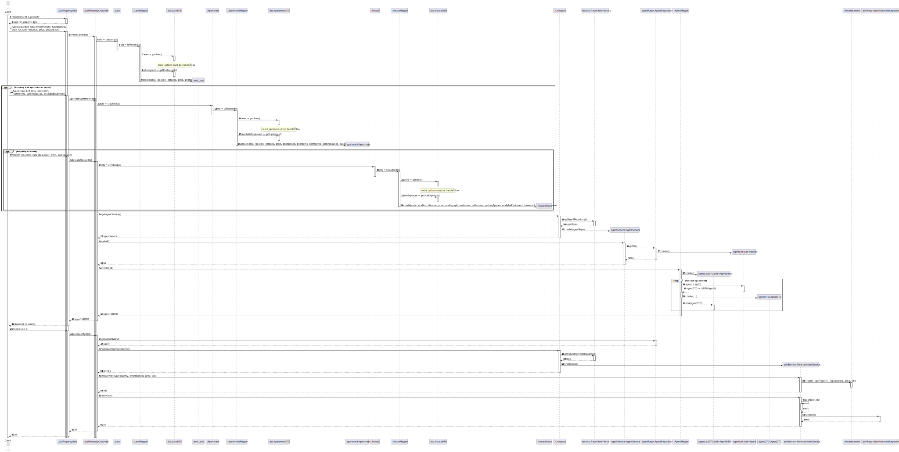
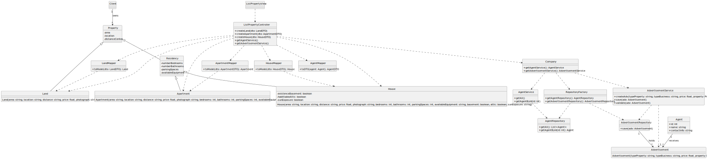

# US 30 - Request to list a property for sale or rent.

## 1. Requirements Engineering

### 1.1. User Story Description

As Client, I want to request to list a property for sale or rent.

### 1.2. Customer Specifications and Clarifications

**From the specifications document:**

>Owners can choose, if they want, the agent they prefer to promote the property, or letting the system assign one automatically.

>The Owner must provide information about the type of property (apartment, house or land), the area (in square meters), the location,
>the distance from the city center, the requested price, and one or more photographs.

>If the property is an apartment or a house, the owner must also provide the number of bedrooms, the number of bathrooms, the number 
>of parking spaces and the available equipment, such as central heating and/or air conditioning.

>If the property is a house, the existence of a basement or habitable attic, as well as sun exposure must also be recorded.

**From the client clarifications:**

> **Question:** ?
>
> **Answer:** *

### 1.3. Acceptance Criteria

- AC30-1: The client should start by choosing the type of property to list (apartment, house or land).
- AC30-2: Providing distance from the city center is optional.

### 1.4. Found out Dependencies

- The client must be registered and logged in.

### 1.5. Input and Output Data

**Input Data:**

- Typed data:
    - an area 
    - a location
    - a distance
    - a price
    - photograph(s)
    - number of bedrooms
    - number of bathrooms
    - number of parking spaces
    - available equipment
    - basement
    - attic
    - sun exposure

- Selected data:
    - an id
    - a property type

**Output Data:**

- All available agents id
- All property types
- (In)success of the operation

### 1.6. System Sequence Diagram (SSD)

### 1.7. Other Relevant Remarks

- Nothing to report for now.

## 2. OO Analysis

### 2.1. Relevant Domain Model Excerpt

### 2.2. Other Remarks

- n/a

## 3. Design - User Story Realization

### 3.1. Rationale

| Interaction ID | Question: Which class is responsible for...   | Answer                   | Justification (with patterns)                                                                                                     |
|:---------------|:----------------------------------------------|:-------------------------|:----------------------------------------------------------------------------------------------------------------------------------|
| Step 1  		     | 	... interacting with the actor?              | ListPropertyView         | Pure Fabrication: there is no reason to assign this responsibility to any existing class in the Domain Model.                     |
| 			  		        | 	... coordinating the US?                     | ListPropertyController   | Controller                                                                                                                        |
| 			  		        | 	... knowing the AdvertisementRepository?     | Company                  | IE: Company knows all its advertisements                                                                                          |
| 			  		        | 	                                             | AdvertisementService     | By applying High Cohesion (HC) + Low Coupling (LC) on class Company, it delegates the responsibility on AdvertisementService.     |
| 			  		        | ... creating the PropertyRepository?          | RepositoryFactory        | Factory method pattern                                                                                                            |
| Step 2  		     | 	... requesting data?				                     | RegisterStoreView        | IE: is responsible for user interactions.                                                                                         |
| Step 3  		     | 	... saving the inputted data?                | Land, Apartment or House | IE: Those classes represent each type of property, and they hold the data related to that property.                               | 
| 		             | 	... validating all data (local validation)?  | Land, Apartment or House | IE: Just like before, it holds the data related to that property so it should validate it on its own (Tell, Don't Ask principle). | 
| 			  	         | 	... validating all data (global validation)? | PropertyService          | IE: knows all existing properties.                                                                                                |
| Step 4  		     | 	... knowing all Agents?                      | AgentRepository          | IE: Knows all its agents.                                                                                                         | | 
| 		             | 	... listing all agents                       | ListPropertyView         | IE: Is responsible for user interactions.                                                                                         | | 
| Step 5  		     | 	                                             |                          |                                                                                                                                   | | 
| Step 6  		     | 	... Informing operation success?             | ListPropertyView         | IE: Is responsible for user interactions.                                                                                         | | 

### Systematization

According to the taken rationale, the conceptual classes promoted to software classes are:

- Company
- Land
- Apartment
- House

Other software classes (i.e. Pure Fabrication) identified:

- ListPropertyView
- ListPropertyController
- AdvertisementService
- RepositoryFactory
- PropertyService
- AgentRepository
- AdvertisementRepository

### 3.2. Sequence Diagram (SD)

### 3.3. Class Diagram (CD)

**Note: private methods were omitted.**

