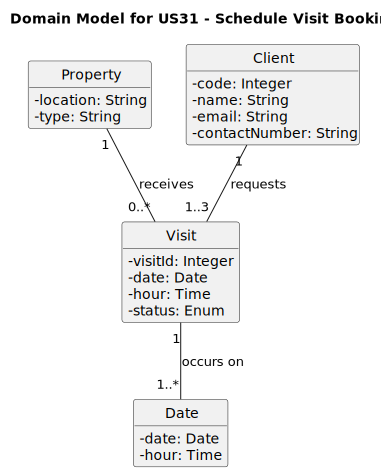
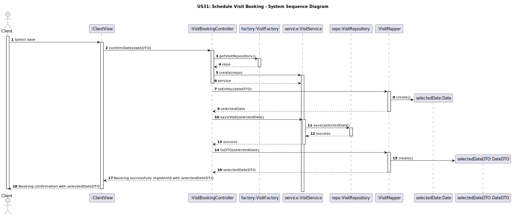
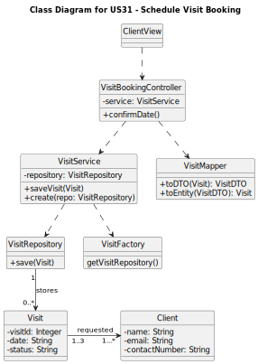

US31

# US31 - Request a Visit Booking

## 1. Requirements Engineering

### 1.1. User Story Description

As a **Client**, I want to request a visit booking so that I can schedule a visit to a property for sale or rent.

### 1.2. Customer Specifications and Clarifications

**From the specifications document:**

> **Question:** Is the client able to request a visit for any property, or are there restrictions?
>
> **Answer:** The client can request a visit for any property listed and available for viewing.

**From client clarifications:**

> **Question:** Can the client choose dates that are outside operating hours?
>
> **Answer:**  Yes the Client can choose dates out of the operating hours.

### 1.3. Acceptance Criteria

- **AC31-1:** Day and time should be entered in the format `dd-mm-yyyy` and `hh:mm`, respectively.
- **AC31-2:** A maximum of 3 preferred dates must be accepted.

## 1.4. Found out Dependencies

**Dependency with Property Listings (US40):** The visit booking functionality depends on the availability of the properties.

**Interaction with Client Registration (US21):** Ensures that only registered clients can request a visit.

**Dependency with Visit Scheduling System:** The system must be able to check the availability of agents and schedule the visit accordingly.

### 1.5 Input and Output Data

- **Input Data:** Date and time inputs (up to 3 preferred dates) from the client.
- **Output Data:** 

    **-In case of success:** Confirmation of the booking with the selected dates and times.

    **-In case of conflict:** Notification listing the unavailable dates and times.

### 1.6. System Sequence Diagram (SSD)

### 1.7 Other Relevant Remarks

- **Frequency:** This feature will be used frequently by clients who are interested in scheduling viewings.
- **Performance Constraint:** Must meet a response time of less than 3 seconds for the UI interaction.

## 2. OO Analysis

### 2.1. Relevant Domain Model Excerpt

### 2.2. Other Remarks

- n/a

## 3. Design - User Story Realization

### 3.1. Rationale
| **Interaction ID** | **Question: Which class is responsible for...**                   | **Answer**                   | **Justification (with patterns)**                                                                                                                       |
|--------------------|-------------------------------------------------------------------|------------------------------|---------------------------------------------------------------------------------------------------------------------------------------------------------|
| **Step 1**         | ... interacting with the client and receiving the selected date?  | **ClientView**               | **Pure Fabrication**: The **ClientView** manages the interaction with the client, allowing date selection input. |
| **Step 2**         | ... confirming the booking after the date selection?             | **VisitBookingController**   | **Controller**: **VisitBookingController** handles the confirmation process and ensures that the booking is registered in the system. |

Conceptual classes promoted to software classes:

- **Date**
- **Property**
- **Visit**
- **Client**

Other software classes (Pure Fabrication) identified:

- **VisitFactory**
- **VisitRepository**
- **VisitService**
- **ClientView**
- **VisitMapper**
- **VisitBookingController**

### 3.2. Sequence Diagram (SD)

### 3.3. Class Diagram (CD)

**Note: private methods were omitted.**

## 4. Tests

_In this section, it is suggested to systematize how the tests were designed to allow a correct measurement of requirements fulfilling._

**_DO NOT COPY ALL DEVELOPED TESTS HERE_**

**Test 1:** Check that it is not possible to create an instance of the Example class with empty values.

    class ExampleFixture : public ::testing::Test {
        TEST_F(ExampleFixture, CreateWithEmptyCode){
            EXPECT_THROW(new Example(L"",L"Example One"),std::invalid_argument);
        }
    }

_It is also recommended organizing this content by subsections._

## 5. Integration and Demo

_In this section, it is suggested to describe the efforts made to integrate this functionality with the other features of the system._

## 6. Observations

_In this section, it is suggested to present a critical perspective on the developed work, pointing, for example, to other alternatives and or future related work._
