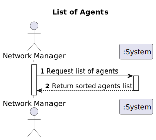
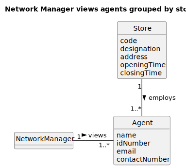
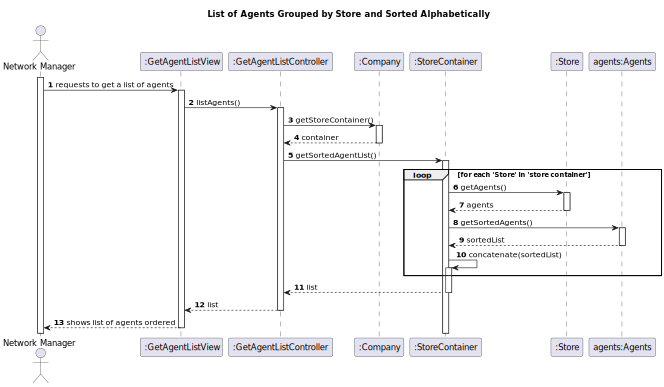
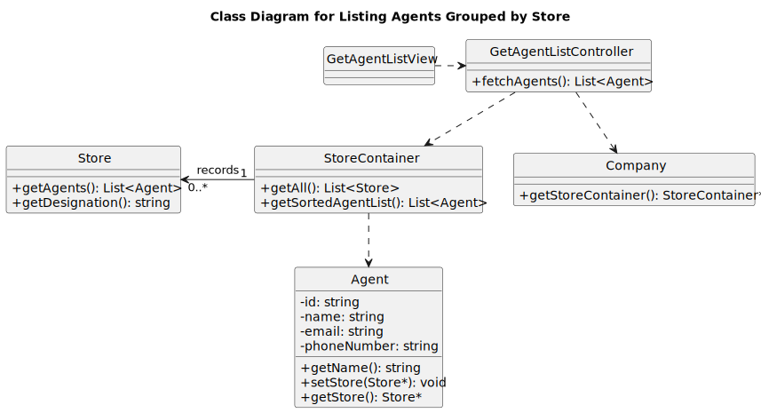

# US51 - Retrieve List of Agents

## 1. Requirements Engineering

### 1.1. User Story Description

As a **Network Manager**, I want to retrieve a list of all agents so that I can view the organization of agents by store.

### 1.2. Customer Specifications and Clarifications 

**From the specifications document:**

> **Question:** Can agents be listed from multiple stores, or is it a single store at a time?
>
> **Answer:** The system must display agents from all stores, grouped by store, with agents listed alphabetically within each store.

**From the client clarifications:**

> **Question:** Should the list of agents be editable or just viewable?
>
> **Answer:**  The list of agents is just viewable.

### 1.3. Acceptance Criteria

- **AC51-1:** Agents should be grouped by store, with each group displayed in alphabetical order by agent name.

## 1.4. Found out Dependencies

**Dependency with Store Data:** The functionality relies on store data to organize the agents.

**Interaction with Agent Registration (US11):** It depends on the registered agent data, as per the agent registration feature (US11), ensuring that all necessary agent information is available for listing.

**Dependency with Store Registration (US10):** The functionality of listing agents also depends on US10, since stores must be registered beforehand for agents to be organized and listed by store.

### 1.5 Input and Output Data

- **Input Data:** Selection of the “View Agents List” option by the Network Manager.
- **Output Data:** n/a

### 1.6. System Sequence Diagram (SSD)

The SSD illustrates interactions between the Network Manager and the system, showing data retrieval and display steps.

### 1.7 Other Relevant Remarks

- **Frequency:** This feature is likely to be accessed frequently for administrative purposes.
- **Performance Constraint:** Must conform to the specified 3-second response time for UI interactions.

## 2. OO Analysis

### 2.1. Relevant Domain Model Excerpt 

### 2.2. Other Remarks

- n/a

## 3. Design - User Story Realization

### 3.1. Rationale

| **Interaction ID** | **Question: Which class is responsible for...**                   | **Answer**                   | **Justification (with patterns)**                                                                                                                       |
|--------------------|-------------------------------------------------------------------|------------------------------|---------------------------------------------------------------------------------------------------------------------------------------------------------|
| **Step 1**         | ... interacting with the actor?                                  | **GetAgentListView**          | **Pure Fabrication**: A classe **GetAgentListView** gerencia a interação com o usuário. Ela é uma interface de usuário que não está no modelo de domínio. |
|                    | ... coordinating the operation flow?                              | **GetAgentListController**    | **Controller**: **GetAgentListController** coordena a operação entre a **GetAgentListView** e a **StoreContainer** para obter a lista de agentes. |
|                    | ... requesting the list of agents?                                | **GetAgentListController**    | **Creator (Rule 1)**: **GetAgentListController** solicita a lista de agentes da **StoreContainer**. |
|                    | ... retrieving the list of agents?                                | **StoreContainer**            | **High Cohesion + Low Coupling**: **StoreContainer** gerencia as lojas e fornece acesso à lista ordenada de agentes. |
| **Step 2**         | ... displaying the list of agents?                                | **GetAgentListView**          | **IE**: **GetAgentListView** exibe a lista de agentes de forma ordenada e organizada para o usuário. |

### Systematization

According to the rationale, the conceptual classes promoted to software classes are:

- **Store**
- **Agent**

Other software classes (i.e., Pure Fabrication) identified:

- **StoreContainer**
- **GetAgentListView**
- **GetAgentListController**
- **Company**

### 3.2. Sequence Diagram (SD)

### 3.3. Class Diagram (CD)

**Note: private methods were omitted.**

## 4. Tests

_In this section, it is suggested to systematize how the tests were designed to allow a correct measurement of requirements fulfilling._

**_DO NOT COPY ALL DEVELOPED TESTS HERE_**

**Test 1:** Check that it is not possible to create an instance of the Example class with empty values.

    class ExampleFixture : public ::testing::Test {
        TEST_F(ExampleFixture, CreateWithEmptyCode){
            EXPECT_THROW(new Example(L"",L"Example One"),std::invalid_argument);
        }
    }

_It is also recommended organizing this content by subsections._

## 5. Integration and Demo

_In this section, it is suggested to describe the efforts made to integrate this functionality with the other features of the system._

## 6. Observations

_In this section, it is suggested to present a critical perspective on the developed work, pointing, for example, to other alternatives and or future related work._