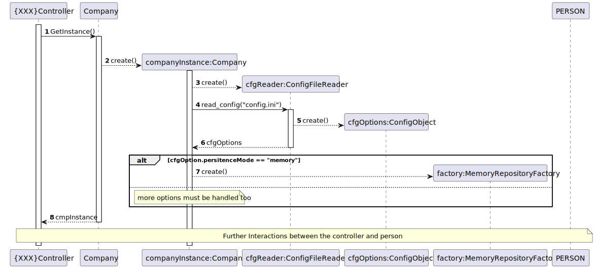

# Describing App Initialization

## Overview of the Designed Approach

- **Company** is a singleton.
- The method **GetInstance** is _static_. Notice it is being called on the class and not to an **Company instance** (the **":"** denotes an instance).
- The **App instance** is being created in a _lazy load_ fashion, i.e. it's created only when needed for the first time.
- The concrete **FactoryRepository** to be used is determined according to the configured information existing on the **config.ini** file which can be changed during the system implantation/deployment.

