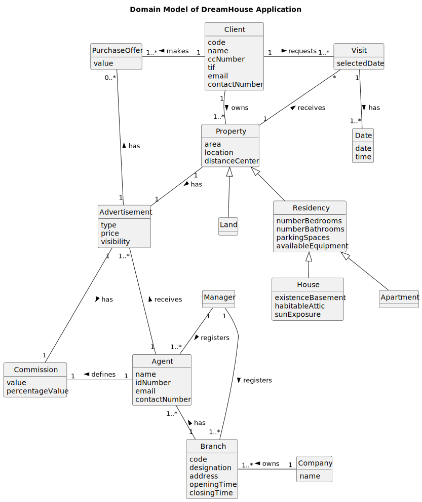

# OO Analysis

The construction process of the domain model is based on the client specifications, especially the nouns (for _concepts_) and verbs (for _relations_) used.

## Rationale to identify domain conceptual classes
To identify domain conceptual classes, start by making a list of candidate conceptual classes inspired by the list of categories suggested in the book "Applying UML and Patterns: An Introduction to Object-Oriented Analysis and Design and Iterative Development".

### _Conceptual Class Category List_

**Business Transactions**

* SellOffer
* PurchaseOffer

---

**Transaction Line Items**

-

---

**Product/Service related to a Transaction or Transaction Line Item**

* Property

---

**Transaction Records**

-

---

**Roles of People or Organizations**

* Agent
* Client
* Owner
---

**Places**

* Branch

---

**Noteworthy Events**

* Visit

---

**Physical Objects**

-

---

**Descriptions of Things**

-

---

**Catalogs**

-

---

**Containers**

-

---

**Elements of Containers**

-

---

**Organizations**

* Company

---

**Other External/Collaborating Systems**

-

---

**Records of finance, work, contracts, legal matters**

-

---

**Financial Instruments**

* Commission

---

**Documents mentioned/used to perform some work**

-

---

## Rationale to identify associations between conceptual classes

An association is a relationship between instances of objects that indicates a relevant connection and that is worth of remembering, or it is derivable from the List of Common Associations:

- **_A_** is physically or logically part of **_B_**
- **_A_** is physically or logically contained in/on **_B_**
- **_A_** is a description for **_B_**
- **_A_** is known/logged/recorded/reported/captured in **_B_**
- **_A_** uses or manages or owns **_B_**
- **_A_** is related with a transaction (item) of **_B_**
- etc.

| Concept (A) 		 |  Association   	   |    Concept (B) |
|----------------|:------------------:|---------------:|
| Company  	     |    owns    		 	    |         Branch |
| Branch  	      |    has    		 	     |          Agent |
| Agent  	       |   defines    		    |     Commission |
| Property       |        has         |     Commission | 
| Property       |        has         | Purchase Offer |  
| Property       |        has         |     Sale Offer | 
| Agent          | schedules/receives |          Visit |
| Property       |      receives      |          Visit |
| Client         |      requests      |          Visit |
| Client         |       makes        |  PurchaseOffer |
| Client         |      consults      |       Property |
| Owner          |       makes        |     Sale Offer |  
| Owner          |        owns        |       Property |  
| Agent          |     schedules      |          Visit |
| Manager        |     registers      |          Agent |
| Manager        |     registers      |         Branch |

## Domain Model

**Don't forget to also identify the attributes of concepts.**

**Insert below the Domain Model Diagram in a SVG format.**

