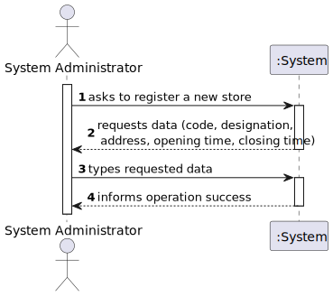
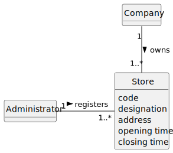
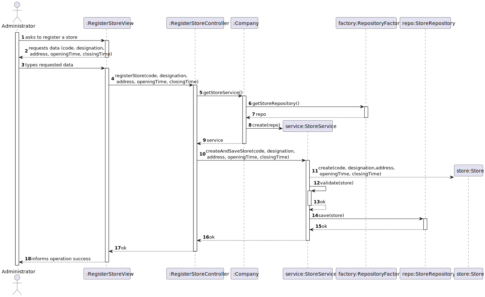
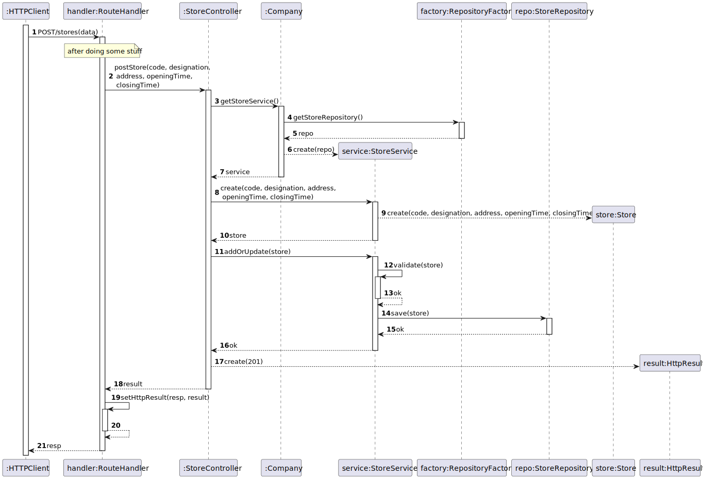
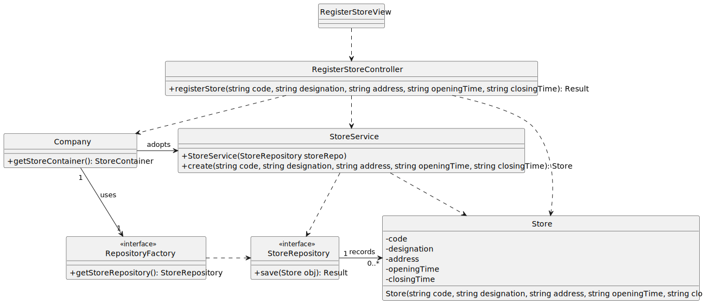
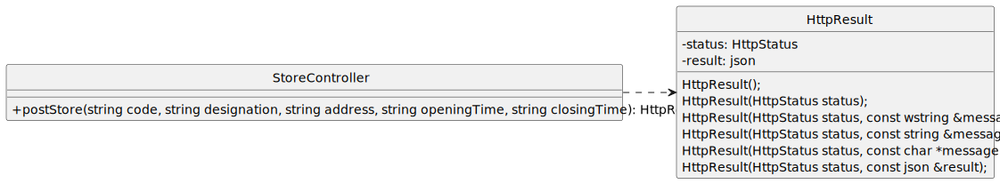

# US 10 - Register a Store

## 1. Requirements Engineering

### 1.1. User Story Description

As System Administrator, I want to register a new store.

### 1.2. Customer Specifications and Clarifications

**From the specifications document:**

>No specifications were found.

**From the client clarifications:**

> **Question:** ?
>
> **Answer:** *

### 1.3. Acceptance Criteria

- AC01-1: The store code must be unique and have five alphanumeric characters.
- AC01-2: Opening and closing times should be entered in the format hh:mm.

### 1.4. Found out Dependencies

- No dependencies were found.

### 1.5. Input and Output Data

**Input Data:**

- Typed data:
  - a code
  - a designation
  - an address
  - an opening time
  - a closing time

- Selected data:
  - n/a

**Output Data:**

- (In)success of the operation

### 1.6. System Sequence Diagram (SSD)

### 1.7. Other Relevant Remarks

- Nothing to report for now.

## 2. OO Analysis

### 2.1. Relevant Domain Model Excerpt

### 2.2. Other Remarks

- n/a

## 3. Design - User Story Realization

### 3.1. Rationale

| Interaction ID | Question: Which class is responsible for...   | Answer                  | Justification (with patterns)                                                                                                                                                                                        |
|:---------------|:----------------------------------------------|:------------------------|:---------------------------------------------------------------------------------------------------------------------------------------------------------------------------------------------------------------------|
| Step 1  		     | 	... interacting with the actor?              | RegisterStoreView       | Pure Fabrication: there is no reason to assign this responsibility to any existing class in the Domain Model.                                                                                                        |
| 			  		        | 	... coordinating the US?                     | RegisterStoreController | Controller                                                                                                                                                                                                           |
| 			  		        | 	... instantiating a new Store?               | Company                 | Creator (Rule 1): Company contains or aggregates instances of Store                                                                                                                                                  |
| 			  		        | 	                                             | StoreService            | By applying High Cohesion (HC) + Low Coupling (LC) on class Company, it delegates the responsibility on StoreContainer, however by applying the Repository pattern, it delegates the responsibility on StoreService. |
| 			  		        | ... saving store instances?                   | StoreRepository         | Repository Pattern.                                                                                                                                                                                                  |
| 			  		        | ... saving repository instances?              | RepositoryFactory       | Factory Pattern.                                                                                                                                                                                                     |
| Step 2  		     | 	... requesting data?				                     | RegisterStoreView       | IE: is responsible for user interactions.                                                                                                                                                                            |
| Step 3  		     | 	... saving the inputted data?                | Store                   | IE: Store class represents a single store, and it holds the data related to that store.                                                                                                                              | 
| 		             | 	... validating all data (local validation)?  | Store                   | IE: Just like before, it holds the data related to that store so it should validate it on its own (Tell, Don't Ask principle).                                                                                       | 
| 			  	         | 	... validating all data (global validation)? | StoreService            | IE: knows all existing stores.                                                                                                                                                                                       |
| Step 4  		     | 	... informing operation success?             | RegisterStoreView       | IE: is responsible for user interactions.                                                                                                                                                                            | | 

### Systematization

According to the taken rationale, the conceptual classes promoted to software classes are:

- Company
- Store

Other software classes (i.e. Pure Fabrication) identified:

- RegisterStoreView
- RegisterStoreController
- StoreService
- StoreRepository
- RepositoryFactory

### 3.2. Sequence Diagram (SD)

### 3.2.1. Previous Perspective (using Controllers for a Console UI)

**Notice that:**

- According to the Repository and Service patterns, the StoreContainer was split in two classes: StoreRepository and StoreService, respectively.
- The RepositoryFactory class is the result of applying the Abstract Factory pattern to ensure that the "{XXX}Repository" classes used are all from the same family of objects (i.e., they use the same persistence mechanism).
- No DTO was used, but it could have been.

### 3.2.2 REST API Perspective (reusing the domain logic)

**To accommodate the Sprint 4 requirements.**

**This SD is in conformity with the Generic Flow in any HTTP Request defined [here](../HTTPFlow/HTTPFlow.md).**

**For brevity, sequence diagrams, can be simplified to denote just what happens on the respective Controller.**

### 3.3. Class Diagram (CD)

### 3.3.1 Previous Perspective (using Controllers for a Console UI)

Class diagram as resulting from the above sequence diagram and rationale:

Adding to the previous class diagram the classes currently implementing the adopted interfaces.
Notice that the sequence diagram does not state which concrete implementation is being used since it may vary by configurations (cf. "config.ini" file).

### 3.3.2 REST API Perspective (reusing the domain logic)

**To accommodate the Sprint 4 requirements.**

Just the new classes are shown

## 4. Tests

Three relevant test scenarios are highlighted next.
Other tests were also specified.

**Test 1:** Check that it is not possible to create an instance of the Store class with invalid values.

      TEST_F(StoreFixture, CreateWithEmptyCode) {
          EXPECT_THROW(new Store(L"", "Store one", "address", "12:33", "18:00"), std::invalid_argument);
      }

      TEST_F(StoreFixture, CreateWithCodeHavingFourChars) {
          EXPECT_THROW(new Store(L"C001", "Store One", "address", "12:33", "18:00"), std::invalid_argument);
      }

      TEST_F(StoreFixture, CreateWithEmptyDesignation) {
          EXPECT_THROW(new Store(L"S0001", "", "address", "12:33", "18:00"), std::invalid_argument);
      }
      
      TEST_F(StoreFixture, CreateWithEmptyAddress) {
          EXPECT_THROW(new Store(L"S0001", "Store One", "", "12:33", "18:00"), std::invalid_argument);
      }
      
      TEST_F(StoreFixture, CreateWithOpeningTimeInWrongFormat) {
          EXPECT_THROW(new Store(L"S0001", "Store One", "address", "12:3", "18:00"), std::invalid_argument);
      }
      
      TEST_F(StoreFixture, CreateWithClosingTimeInWrongFormat) {
          EXPECT_THROW(new Store(L"S0001", "Store One", "address", "12:33", "18:0"), std::invalid_argument);
      }

**Test 2:** Check that it is possible to create an instance of the Store class with valid values.

      TEST_F(StoreFixture, CreateWithValidData) {
          EXPECT_NO_THROW(new Store(L"S0001", "Store One", "address", "12:33", "18:00"));
      }

**Test 3:** Check that it is possible to create and add/save a store on the StoreMemoryRepository.

      TEST_F(StoreMemoryRepositoryFixture, AddingOneCategory) {
          EXPECT_TRUE(this->repo->isEmpty());
          shared_ptr<Store> store = make_shared<Store>(L"S0001", "Store One", "address", "12:33", "18:00");
          this->repo->save(store);
          EXPECT_FALSE(this->repo->isEmpty());
      }

## 5. Integration and Demo

A menu option on the console application was added. If the user is a System Administrator he will be able to choose that option
which will take him to the RegisterStoreView.

    int AuthMenuView::processMenuOption(int option) {
        int result = 0;
        BaseView *view;
        switch (option) {
          case 1:
            if(this->userToken == L"Client"){
                view = new ListPropertyView(this->userToken);
                view->show();
                break;
            }
            if(this->userToken == L"SysAdmin") {
                view = new RegisterStoreView(this->userToken);
                view->show();
                break;
            }
            if(this->userToken==L"NetManager"){
                view = new ListDealsView(this->userToken);
                view->show();
                break;
            }
          default:
              result=-1;
              break;
        }
        return result;
    }

## 6. Observations

n/a