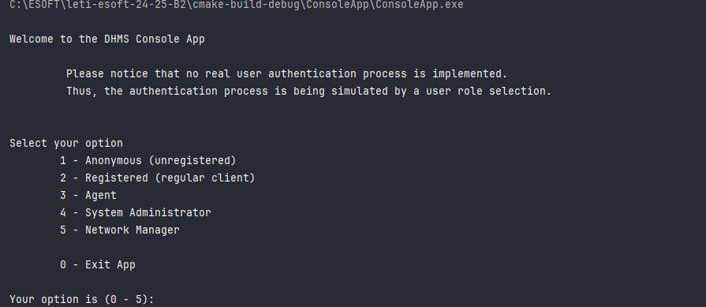

# US 20 - Display listed properties

## 1. Requirements Engineering

_In this section, it is suggested to capture the User Story description and the requirements specification as provided by the client, as well as any further clarifications on it. It is also suggested to capture the client acceptance criteria and existing dependencies to other requirements. Finally, identify the involved input and output data and depict an Actor-System interaction in order to fulfill the requirements._

### 1.1. User Story Description

As an unregistered user , i want to display listed properties.

### 1.2. Customer Specifications and Clarifications 

**The display of listed properties (US20) must include:**
- type of property (apartment, house or land)
- location
- area
- requested price
- 
**If the property is an apartment or house, it must also include:**
- number of bedrooms
- number of bathrooms
- number of parking spaces

### 1.3. Acceptance Criteria

No acceptance criterias.

### 1.4. Found out Dependencies

No dependencies found.

### 1.5 Input and Output Data

**Input Data:**

- Typed data:
  - n/a

- Selected data:
  - n/a
    

**Output Data:**

- The list of properties that are being displayed
- (In)success of the operation

### 1.6. System Sequence Diagram (SSD)

### 1.7 Other Relevant Remarks

n/a

## 2. OO Analysis

### 2.1. Relevant Domain Model Excerpt 

### 2.2. Other Remarks

n/a

## 3. Design - User Story Realization 

### 3.1. Rationale

**The rationale grounds on the SSD interactions and the identified input/output data.**

| Interaction ID | Question: Which class is responsible for...    | Answer                            | Justification (with patterns)                                                                                 |
|:---------------|:-----------------------------------------------|:----------------------------------|:--------------------------------------------------------------------------------------------------------------|
| Step 1  		     | 		... interacting with the actor?					         | DisplayListedPropertiesView       | Pure Fabrication: there is no reason to assign this responsibility to any existing class in the Domain Model. |
| 		             | 			... coordinating the US?				                | DisplayListedPropertiesController | Controller: Manages the interactions between the view and model classes (Company, StoreContainer, etc.).      |
| 		             | 			.. knowing the AdvertisementRepository?				 | Company                           | IE: Company knows the Advertisement Repository                                                                |
| 		             | 			... listing all Advertisements?				         | AdvertisementRepository           | Repository Pattern.                                                                                           |
| 		             | 			... creating the Repository				             | RepositoryFactory                 | Factory Method Pattern                                                                                        |
| Step 2         | 			... knowing the Advertisement?				          | AdvertisementRepository           | IE: AdvertisementRepository knows the Advertisement                                                           |
|                | 				... requesting data?				                   | DisplayListedPropertiesView       | IE: is responsible for user interactions.                                                                     |
| Step 3         | 					.. knowing the Property		                 | Advertisement                     | IE: Advertisement knows Property                                                                              |              
| 		             | 					..knowing the type of Property	           | Advertisement                     | IE: Advertisement knows Property                                                                              |   
| 		             | 					..knowing the Residency		                 | Property                          | Creator: Residency inherits from Property                                                                     |               
| 		             | 					... informing operation success?	         | DisplayListedPropertiesView       | IE: is responsible for user interactions.                                                                     |              

### Systematization ##

According to the taken rationale, the conceptual classes promoted to software classes are:

- Company
- Advertisement
- Property
- Residency

Other software classes (i.e. Pure Fabrication) identified:

- DisplayListedPropertiesView
- DisplayListedPropertiesController
- RepositoryFactory
- AdvertisementService
- AdvertisementRepository
- DisplayedPropertyMapper

### 3.2. Sequence Diagram (SD)

_In this section, it is suggested to present an UML dynamic view representing the sequence of interactions between software objects that allows to fulfill the requirements._

### 3.3. Class Diagram (CD)

_In this section, it is suggested to present an UML static view representing the main related software classes that are involved in fulfilling the requirements as well as their relations, attributes and methods._

## 4. Tests 

_In this section, it is suggested to systematize how the tests were designed to allow a correct measurement of requirements fulfilling._

**_DO NOT COPY ALL DEVELOPED TESTS HERE_**

**Test 1:** Check that it is not possible to create an instance of the Example class with empty values. 

    class ExampleFixture : public ::testing::Test {
        TEST_F(ExampleFixture, CreateWithEmptyCode){
            EXPECT_THROW(new Example(L"",L"Example One"),std::invalid_argument);
        }
    }

_It is also recommended organizing this content by subsections._ 

## 5. Integration and Demo

A menu option on the console application was added. If the user is untegistered he will be able to choose that option
which will take him to the DisplayListedPropertiesView.

    int AuthMenuView::processMenuOption(int option) {
    int result = 0;
    BaseView *view;
    switch (option) {
        case 1:
            if(this->userToken == L"Unregistered"){
                view = new DisplayListedPropertiesView(); // Open DisplayListedPropertiesView
                view->show();
                break;
            }
            if(this->userToken == L"Client"){
                view = new ListPropertyView();
                view->show();
                break;
            }
            if(this->userToken == L"SysAdmin") {
                view = new RegisterStoreView();
                view->show();
                break;
            }
            if(this->userToken==L"NetManager"){
                view = new ListDealsView();
                view->show();
                break;
            }

        case 2:
            if(this->userToken==L"SysAdmin"){
                view = new RegisterAgentView();
                view->show();
                break;
            }
        default:
            result=-1;
            break;
    }
    return result;
    }

## 6. Observations

_In this section, it is suggested to present a critical perspective on the developed work, pointing, for example, to other alternatives and or future related work._