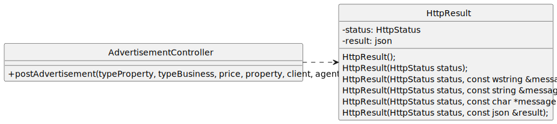

# US 30 - Request to list a property for sale or rent.

## 1. Requirements Engineering

### 1.1. User Story Description

As Client, I want to request to list a property for sale or rent.

### 1.2. Customer Specifications and Clarifications

**From the specifications document:**

>Owners can choose, if they want, the agent they prefer to promote the property, or letting the system assign one automatically.

>The Owner must provide information about the type of property (apartment, house or land), the area (in square meters), the location,
>the distance from the city center, the requested price, and one or more photographs.

>If the property is an apartment or a house, the owner must also provide the number of bedrooms, the number of bathrooms, the number 
>of parking spaces and the available equipment, such as central heating and/or air conditioning.

>If the property is a house, the existence of a basement or habitable attic, as well as sun exposure must also be recorded.

**From the client clarifications:**

> **Question:** ?
>
> **Answer:** *

### 1.3. Acceptance Criteria

- AC30-1: The client should start by choosing the type of property to list (apartment, house or land).
- AC30-2: Providing distance from the city center is optional.

### 1.4. Found out Dependencies

- There has to be at least one client in the system (US21).
- There has to be at least one agent in the system (US11).

### 1.5. Input and Output Data

**Input Data:**

- Typed data:
    - an area
    - a location
    - a distance
    - a price
    - a type of property
    - photograph(s)
    - number of bedrooms
    - number of bathrooms
    - number of parking spaces
    - available equipment

- Selected data:
    - an id
    - basement existence
    - habitable attic existence
    - sun exposure existence

**Output Data:**

- All available agents id
- (In)success of the operation

### 1.6. System Sequence Diagram (SSD)

### 1.7. Other Relevant Remarks

- Nothing to report for now.

## 2. OO Analysis

### 2.1. Relevant Domain Model Excerpt

### 2.2. Other Remarks

- n/a

## 3. Design - User Story Realization

### 3.1. Rationale

| Interaction ID  | Question: Which class is responsible for...                   | Answer                                     | Justification (with patterns)                                                                                                                                                                                                                              |
|:----------------|:--------------------------------------------------------------|:-------------------------------------------|:-----------------------------------------------------------------------------------------------------------------------------------------------------------------------------------------------------------------------------------------------------------|
| Step 1  		      | 	... interacting with the actor?                              | ListPropertyView                           | Pure Fabrication: there is no reason to assign this responsibility to any existing class in the Domain Model.                                                                                                                                              |
| 			Step 2/4  		 | 	... coordinating the US?                                     | ListPropertyController                     | Controller                                                                                                                                                                                                                                                 |
| 			  		         | 	 ... knowing all Clients?                                    | Company                                    | IE: Company knows all its clients.                                                                                                                                                                                                                         |
| 			  		         | 	                                                             | ClientRepository                           | By applying High Cohesion (HC) + Low Coupling (LC) on class Company, it delegates the responsibility on ClientContainer, however by also applying the Repository Pattern, it delegates the responsibility on ClientRepository.                             |
| 			  		         | 	... knowing the ClientRepository?                            | ClientService                              | By applying High Cohesion (HC) + Low Coupling (LC) on class ClientRepository, it delegates business responsibilities on ClientService, while the ClientRepository has persistence responsibilities.                                                        |
| 			  		         | ... saving repository instances?                              | RepositoryFactory                          | Factory method pattern                                                                                                                                                                                                                                     |
| 		              | 	... requesting data?				                                     | ListPropertyView                           | IE: is responsible for user interactions.                                                                                                                                                                                                                  |
| Step 3/5  		    | 	... saving the inputted data?                                | Land, Apartment or House                   | IE: Those classes represent each type of property, and they hold the data related to that property.                                                                                                                                                        |
| 		              | 	... transforming the inputted dto into a model object?       | LandMapper, ApartmentMapper or HouseMapper | DTO pattern                                                                                                                                                                                                                                                |
| 		              | 	... validating all data (local validation)?                  | Land, Apartment or House                   | IE: Just like before, it holds the data related to that property so it should validate it on its own (Tell, Don't Ask principle).                                                                                                                          | 
| 			  	          | 	... validating all data (global validation)?                 | AdvertisementService                       | IE: knows all advertisements through AdvertisementRepository (a property can only exist if an advertisement is being published, so advertisementService will take care of the validation).                                                                 |
| Step 6  		      | 	... knowing all Agents?                                      | AgentRepository                            | IE: Knows all its agents.                                                                                                                                                                                                                                  | | 
| 		              | 	... knowing the AgentRepository?                             | AgentService                               | IE: Just as the ClientService, the AgentService gets business responsibilities.                                                                                                                                                                            | | 
| 		              | 	... transforming an agent object into an agentDTO?           | AgentMapper                                | DTO pattern                                                                                                                                                                                                                                                | |
| 		Step 7	  		   | 	 ... saving inputted data and local validation?              | Advertisement                              | IE: holds the data related to that object.                                                                                                                                                                                                                 |
| 			  		         | 	 ... knowing all Advertisements?                             | Company                                    | IE: Company knows all its advertisements.                                                                                                                                                                                                                  |
| 			  		         | 	                                                             | AdvertisementRepository                    | By applying High Cohesion (HC) + Low Coupling (LC) on class Company, it delegates the responsibility on AdvertisementContainer, however by also applying the Repository Pattern, it delegates the responsibility on AdvertisementRepository.               |
| 			  		         | 	... instantiating a new Advertisement and global validation? | AdvertisementService                       | By applying High Cohesion (HC) + Low Coupling (LC) on class AdvertisementRepository, it delegates the responsibility on AdvertisementService making it have business responsibilities, while the AdvertisementRepository has persistence responsibilities. || 
| Step 8  		      | 	... Informing operation success?                             | ListPropertyView                           | IE: Is responsible for user interactions.                                                                                                                                                                                                                  | | 

### Systematization

According to the taken rationale, the conceptual classes promoted to software classes are:

- Company
- Property
- Residency
- House
- Advertisement

Other software classes (i.e. Pure Fabrication) identified:

- ListPropertyView
- ListPropertyController
- AdvertisementService
- RepositoryFactory
- AgentRepository
- AgentService
- AdvertisementRepository
- PropertyMapper
- HouseMapper
- ResidencyMapper
- ClientService
- ClientRepository
- AgentMapper

### 3.2. Sequence Diagram (SD)

### 3.2.1. Previous Perspective (using Controllers for a Console UI)

### 3.2.2 REST API Perspective (reusing the domain logic)

**To accommodate the Sprint 4 requirements.**

**This SD is in conformity with the Generic Flow in any HTTP Request defined [here](../HTTPFlow/HTTPFlow.md).**

**For brevity, sequence diagrams, can be simplified to denote just what happens on the respective Controller.**

### 3.3. Class Diagram (CD)

### 3.3.1 Previous Perspective (using Controllers for a Console UI)

### 3.3.2 REST API Perspective (reusing the domain logic)

**To accommodate the Sprint 4 requirements.**

Just the new classes are shown

###  3.4 RestAPI Table

| Req. | Method | Resource URI           | Input Body                                                                                                                                                                                                                                                                                                                                                                                                                                                                  | Output Body                                                                                                                                                                                                                                                                                                                                                                                                                                                                                            | Status  |
|------|--------|------------------------|-----------------------------------------------------------------------------------------------------------------------------------------------------------------------------------------------------------------------------------------------------------------------------------------------------------------------------------------------------------------------------------------------------------------------------------------------------------------------------|--------------------------------------------------------------------------------------------------------------------------------------------------------------------------------------------------------------------------------------------------------------------------------------------------------------------------------------------------------------------------------------------------------------------------------------------------------------------------------------------------------|---------|
| R01  | GET    | /advertisements        | n/a                                                                                                                                                                                                                                                                                                                                                                                                                                                                         | [{"agent":{...}, "client":{...}, "code":"...", "commission":"...", "isPercentageValue":"...", "isSold":"...", "price": "...", "property": {"Basement":"...", "HabittableAttic":"...", "SunExposure":"...", "area": "...", "availableEquipment":"...", "distanceCenter":"...", "id":"...", "location":"...", "numberBathrooms":"...", "numberBedrooms":"...", "parkingSpaces":"...", "photograph":"url"}, "typeBusiness": "...", "typeProperty": "...", "visibility": "..." }, {"agent":"...", ......}] | 200     |
| R02  | GET    | /advertisements/{code} | n/a                                                                                                                                                                                                                                                                                                                                                                                                                                                                         | {"agent":{...}, "client":{...}, "code":"...", "commission":"...", "isPercentageValue":"...", "isSold":"...", "price": "...", "property": {"Basement":"...", "HabittableAttic":"...", "SunExposure":"...", "area": "...", "availableEquipment":"...", "distanceCenter":"...", "id":"...", "location":"...", "numberBathrooms":"...", "numberBedrooms":"...", "parkingSpaces":"...", "photograph":"url"}, "typeBusiness": "...", "typeProperty": "...", "visibility": "..." }                            | 200/404 |
| R03  | POST   | /advertisements        | {"agent":{...}, "client":{...}, "code":"...", "commission":"...", "isPercentageValue":"...", "isSold":"...", "price": "...", "property": {"Basement":"...", "HabittableAttic":"...", "SunExposure":"...", "area": "...", "availableEquipment":"...", "distanceCenter":"...", "id":"...", "location":"...", "numberBathrooms":"...", "numberBedrooms":"...", "parkingSpaces":"...", "photograph":"url"}, "typeBusiness": "...", "typeProperty": "...", "visibility": "..." } | {}                                                                                                                                                                                                                                                                                                                                                                                                                                                                                                     | 201/400 |
| R04  | DELETE | /advertisements/{code} | n/a                                                                                                                                                                                                                                                                                                                                                                                                                                                                         | {}                                                                                                                                                                                                                                                                                                                                                                                                                                                                                                     | 200     |
## 4. Tests

Three relevant test scenarios are highlighted next.
Other tests were also specified.

**Test 1:** Check that it is not possible to create an instance of the Advertisement class with invalid values (Property was tested too but for brevity only Advertisement ones are shown).

    TEST_F(AdvertisementFixture, CreateAdvertisementWithInvalidPropertyType) {
      EXPECT_THROW(new Advertisement("Casa", "Sale", 100000, property1, client, agent1), std::invalid_argument);
    }
    
    TEST_F(AdvertisementFixture, CreateAdvertisementWithInvalidTypeBusiness) {
      EXPECT_THROW(new Advertisement("Land", "Venda", 100000, property1, client, agent1), std::invalid_argument);
    }
    
    TEST_F(AdvertisementFixture, CreateAdvertisementWithInvalidPrice) {
      EXPECT_THROW(new Advertisement("Land", "Sale", -100000, property1, client, agent1), std::invalid_argument);
    }

**Test 2:** Check that it is possible to create an instance of the Advertisement class with valid values.

    TEST_F(AdvertisementFixture, CreateValidAdvertisement) {
      EXPECT_NO_THROW(new Advertisement("Land", "Sale", 100000, property1, client, agent1));
    }

**Test 3:** Check the values of an instance of the Advertisement class after creation.

    TEST_F(AdvertisementFixture, GetAdvertisementDataAfterCreation) {
      Advertisement adv("Land", "Rent", 100000, property1, client, agent1);
      EXPECT_EQ(adv.getCode(), L"1");
      EXPECT_EQ(adv.getTypeProperty(), "Land");
      EXPECT_EQ(adv.getTypeBusiness(), "Rent");
      EXPECT_EQ(adv.getPrice(), 100000);
      EXPECT_EQ(adv.getProperty(), property1);
      EXPECT_EQ(adv.getClient(), client);
      EXPECT_EQ(adv.getAgent(), agent1);
    }

## 5. Integration and Demo

A menu option on the console application was added. If the user is a Client he will be able to choose that option
which will take him to the ListPropertyView.

    int AuthMenuView::processMenuOption(int option) {
      int result = 0;
      BaseView *view;
      switch (option) {
        case 1:
          if(this->userToken == L"Unregistered"){
            view = new DisplayListedPropertiesView(); // Open DisplayListedPropertiesView
            view->show();
            break;
          }
          if(this->userToken == L"Client"){
            view = new ListPropertyView();
            view->show();
            break;
          }
          if(this->userToken == L"SysAdmin") {
            view = new RegisterStoreView();
            view->show();
            break;
          }
          if(this->userToken==L"NetManager"){
            view = new ListDealsView();
            view->show();
            break;
          }
        case 2:
            if(this->userToken==L"SysAdmin"){
                view = new RegisterAgentView();
                view->show();
                break;
            }
        default:
            result=-1;
            break;
      }
      return result;
    }

## 6. Observations

n/a