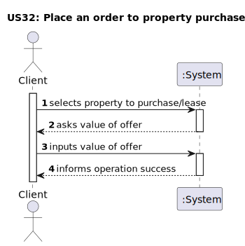
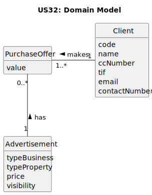
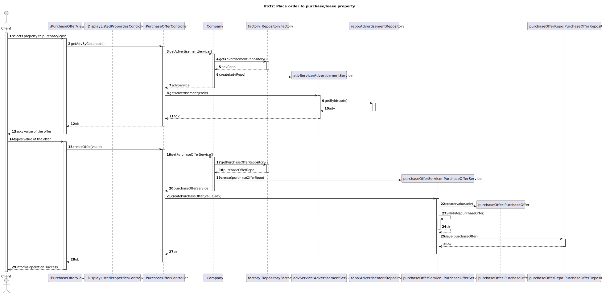
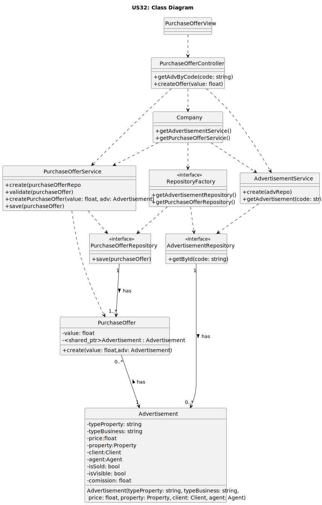

# US 32 - Place an order to property purchase/lease

## 1. Requirements Engineering

_In this section, it is suggested to capture the User Story description and the requirements specification as provided by the client, as well as any further clarifications on it. It is also suggested to capture the client acceptance criteria and existing dependencies to other requirements. Finally, identify the involved input and output data and depict an Actor-System interaction in order to fulfill the requirements._

### 1.1. User Story Description

As a Client, i want to place an order to purchase or lease a property.

### 1.2. Customer Specifications and Clarifications 

Client must be able to choose the value he wants to offer to purchase/lease a property.

### 1.3. Acceptance Criteria

No acceptance criteria.

### 1.4. Found out Dependencies

There is a dependency with [US20](../US20/US20.md), since the client must be able to see the properties that are for sale/lease.

### 1.5 Input and Output Data

**Input Data:**

- Typed data:
  - Value of the offer

- Selected data:
  - Advertisement
    

**Output Data:**

- (In)success of the operation

### 1.6. System Sequence Diagram (SSD)

### 1.7 Other Relevant Remarks

n/a

## 2. OO Analysis

### 2.1. Relevant Domain Model Excerpt 

### 2.2. Other Remarks

n/a

## 3. Design - User Story Realization 

### 3.1. Rationale

**The rationale grounds on the SSD interactions and the identified input/output data.**

| Interaction ID | Question: Which class is responsible for...        | Answer                  | Justification (with patterns)                                                                                                                                                         |
|:---------------|:---------------------------------------------------|:------------------------|:--------------------------------------------------------------------------------------------------------------------------------------------------------------------------------------|
| Step 1  		     | 		... interacting with the actor?					             | PurchaseOfferView       | Pure Fabrication: there is no reason to assign this responsibility to any existing class in the Domain Model.                                                                         |
| 		             | 			... coordinating the US?				                    | PurchaseOfferController | Controller: Manages the interactions between the view and model classes (Company, StoreContainer, etc.).                                                                              |
| 	Step 2	       | 			.. knowing the AdvertisementRepository?				     | Company                 | IE: Company knows the Advertisement Repository                                                                                                                                        |
| 		             | 			... listing all Advertisements?				             | AdvertisementRepository | Repository Pattern.                                                                                                                                                                   |
| 		             | 			... creating the Repositories				               | RepositoryFactory       | Factory Method Pattern                                                                                                                                                                |
|                | 			... knowing the Advertisement?				              | AdvertisementRepository | IE: AdvertisementRepository knows the Advertisement                                                                                                                                   |
| Step 3         | 				... requesting data?				                       | PurchaseOfferView       | IE: is responsible for user interactions.                                                                                                                                             |
| 		             | 	... saving the inputted data?                     | PurchaseOffer           | IE: Holds the data related to that object                                                                                                                                             |
|                | 					.. knowing the PurchaseOfferRepository	       | Company                 | IE: Company knows the PurchaseOfferRepository                                                                                                                                         |              
| 		             | 					..knowing the PurchaseOffer	                  | PurchaseOfferRepository | IE: PurchaseOfferRepository knows PurchaseOffer                                                                                                                                       |   
| 		             | 						      	... instantiating a new PurchaseOffer | PurchaseOfferService    | By applying High Cohesion (HC) + Low Coupling (LC) on class PurchaseOfferRepository, it delegates the responsibility on PurchaseOfferService making it have business responsibilities |
| 		             | 					... informing operation success?	             | PurchaseOfferView       | IE: is responsible for user interactions.                                                                                                                                             |              

### Systematization ##

According to the taken rationale, the conceptual classes promoted to software classes are:

- Company
- Advertisement
- PurchaseOffer

Other software classes (i.e. Pure Fabrication) identified:

- PurchaseOfferView
- PurchaseOfferController
- RepositoryFactory
- AdvertisementService
- AdvertisementRepository
- PurchaseOfferService
- PurchaseOfferRepository

### 3.2. Sequence Diagram (SD)

**US32**

### 3.3. Class Diagram (CD)

_In this section, it is suggested to present an UML static view representing the main related software classes that are involved in fulfilling the requirements as well as their relations, attributes and methods._

## 4. Tests 

_In this section, it is suggested to systematize how the tests were designed to allow a correct measurement of requirements fulfilling._

**_DO NOT COPY ALL DEVELOPED TESTS HERE_**

**Test 1:** Check that it is not possible to create an instance of the Example class with empty values. 

    class ExampleFixture : public ::testing::Test {
        TEST_F(ExampleFixture, CreateWithEmptyCode){
            EXPECT_THROW(new Example(L"",L"Example One"),std::invalid_argument);
        }
    }

_It is also recommended organizing this content by subsections._ 

## 5. Integration and Demo 

_In this section, it is suggested to describe the efforts made to integrate this functionality with the other features of the system._

