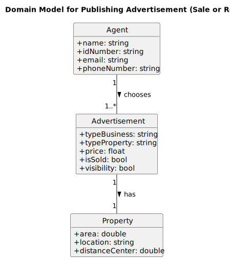

# US40 - Publishing Advertisement (Sale or Rent)

## 1. Requirements Engineering

_In this section, it is suggested to capture the User Story description and the requirements specification as provided by the client, as well as any further clarifications on it. It is also suggested to capture the client acceptance criteria and existing dependencies to other requirements. Finally, identify the involved input and output data and depict an Actor-System interaction in order to fulfill the requirements._

### 1.1. User Story Description

As **Agent**, I want to publish a sale or rent advertisement.

### 1.2. Customer Specifications and Clarifications 

#### Customer Specifications:

>**Unpublished Advertisements Only:**
> The customer emphasized that agents must only be able to select advertisements that are currently in an unpublished state.  
>**Interpretation:** Only unpublished advertisements assigned to the agent should appear in the list, ensuring no overlap with already-published listings.

>**Property Assignment:** 
>Agents should only have access to properties that are explicitly assigned to them.  
>**Interpretation:** The system must maintain a clear association between properties and their respective agents, ensuring access control.

>**Advertisement Details:** The software client requested that the advertisement list should display essential property details for easy identification.  
>**Interpretation:** Display key property attributes, such as type of business (lease or sale), type of property (apartment, house or land), location, area, requested price. If the property is an apartment or house, it also must include the number of bedrooms, bathrooms and/or parking spaces.
 
>**Validation and Error Handling:** Any invalid selections, such as trying to publish an already-published advertisement or selecting a property not assigned to the agent, must prompt appropriate error messages.  
>**Interpretation:** Implement robust validation mechanisms to ensure agents follow the workflow as intended.

>**Single Advertisement Publication:** Agents should publish one advertisement at a time, and avoid bulk actions.  
>**Interpretation:** Limit the interface to single selection and confirmation before transitioning the advertisement to a "published" state.

#### Clarifications:
>**Can agents reassign properties to other agents if needed?**
>No, reassignment of properties is out of scope for this functionality and is managed by higher-level system administrators.

>**What happens if a property has multiple unpublished advertisements?**
>The agent should be allowed to select one unpublished advertisement per property, and the remaining advertisements should remain unpublished.

>**Should the system support any type of advertisement (lease, sale)?**
>Yes, both lease and sale advertisements should be supported and displayed in the list.

### 1.3. Acceptance Criteria

- **AC40-1:** The agent should choose the advertisement from a list of unpublished property listings
assigned to him.

### 1.4. Found out Dependencies

**Dependency with System administrator registers agent (US11):** The assignment of advertisements depends on the availability of agents on the system.

### 1.5 Input and Output Data

#### Input Data:

- The agent does not directly input text for this functionality.

- The agent selects an advertisement from the list of unpublished property listings assigned to them.

#### Output Data:

**Presented Data to the Agent:** 
- **List of Unpublished Advertisements:** 
- Each entry should include: 
  - Property Type (e.g., apartment, house or land)
  - Area
  - Location
  - Distance to City Center
  - Requested Price (sale or rent price)
  - Owner ID (internal code)
  - The system must ensure that only unpublished advertisements assigned to the agent are shown.

**Confirmation Message:**
- After the agent selects an advertisement and publishes it, the system must display a success message confirming the action.

**Error Handling Messages:**
- **Invalid Selection:** If the agent selects an invalid advertisement (e.g., already published or not assigned to them), the system must display an appropriate error message.
- **No Available Advertisements:** If no unpublished advertisements are assigned to the agent, a message indicating this must be displayed.

### 1.6. System Sequence Diagram (SSD)

_Insert here a SSD depicting the envisioned Actor-System interactions and throughout which data is inputted and outputted to fulfill the requirements. All interactions must be numbered._

### 1.7 Other Relevant Remarks

#### **Special Requirements:**
- The system must ensure that agents can only see unpublished advertisements for properties assigned to them. Advertisements for properties assigned to other agents or already published must be excluded from the list.

#### **Data and/or Technology Variations:**
- Input and output data must strictly adhere to the visibility and access rules defined for agents and properties.
- Data presentation should prioritize clarity and usability for the agent.
- Must meet a response time of less than 3 seconds for the UI interaction.

#### **How Often This US is Held:**
- This use case is expected to occur frequently as agents regularly publish property advertisements. 

## 2. OO Analysis

### 2.1. Relevant Domain Model Excerpt 

_In this section, it is suggested to present an excerpt of the Domain Model (DM) that is seen as relevant to fulfill the requirements._

### 2.2. Other Remarks

_Use this section to capture some additional notes/remarks that must be taken into consideration in the design activity. In some cases, it might be useful to add other analysis artifacts (e.g. activity or state diagrams)._

## 3. Design - User Story Realization 

### 3.1. Rationale

**The rationale grounds on the SSD interactions and the identified input/output data.**

| Interaction ID | Question: Which class is responsible for...                          | Answer                   | Justification (with patterns)                                                                                                                                                       |
|:-------------- |:-------------------------------------------------------------------- |:------------------------ |:---------------------------------------------------------------------------------------------------------------------------------------------------------------------------------- |
| Step 1         | ...retrieving the list of unpublished advertisements for the agent?  | `AdvertisementRepository`| **Repository Pattern:** Responsible for managing advertisement data storage and retrieval while abstracting the database implementation.                                            |
| Step 2         | ...verifying agent's ownership of the property listing?              | `PropertyContainer`      | **Information Expert:** Contains ownership and assignment details, ensuring agents interact only with assigned properties.                                                          |
| Step 3         | ...presenting the list of advertisements to the agent?               | `AgentView`              | **View (MVC role):** Handles user interface display and interaction.                                                                                                                |
| Step 4         | ...mapping data between DTOs and entities?                           | `AdvertisementMapper`    | **Pure Fabrication:** Converts between `AdvertisementDTO` and `Advertisement`, isolating mapping logic from domain and persistence layers.                                          |
| Step 5         | ...updating the advertisement status to "Published"?                 | `Advertisement`          | **Protected Variation:** Directly modifies its status, encapsulating core business behavior while protecting against ripple effects of logic changes.                               |
| Step 6         | ...persisting the updated advertisement state?                       | `AdvertisementRepository`| **Repository Pattern:** Saves the updated advertisement entity to the database.                                                                                                    |
### Systematization ##

According to the taken rationale, the conceptual classes promoted to software classes are:

- **Agent**
- **Company**
- **Property**
- **Advertisement**

Other software classes (i.e. Pure Fabrication) identified:

- **`AgentView`**
- **`PublishAdvertisementController`**
- **`PropertyMapper`**
- **`Advertisement Service`**
- **`AdvertisementMapper`**
- **`AdvertisementRepository`**
- **`Repository Factory`**

### 3.2. Sequence Diagram (SD)

_In this section, it is suggested to present an UML dynamic view representing the sequence of interactions between software objects that allows to fulfill the requirements._

### 3.3. Class Diagram (CD)

_In this section, it is suggested to present an UML static view representing the main related software classes that are involved in fulfilling the requirements as well as their relations, attributes and methods._

## 4. Tests 

_In this section, it is suggested to systematize how the tests were designed to allow a correct measurement of requirements fulfilling._

**_DO NOT COPY ALL DEVELOPED TESTS HERE_**

**Test 1:** Check that it is not possible to create an instance of the Example class with empty values. 

    class ExampleFixture : public ::testing::Test {
        TEST_F(ExampleFixture, CreateWithEmptyCode){
            EXPECT_THROW(new Example(L"",L"Example One"),std::invalid_argument);
        }
    }

_It is also recommended organizing this content by subsections._ 

## 5. Integration and Demo 

_In this section, it is suggested to describe the efforts made to integrate this functionality with the other features of the system._

## 6. Observations

_In this section, it is suggested to present a critical perspective on the developed work, pointing, for example, to other alternatives and or future related work._