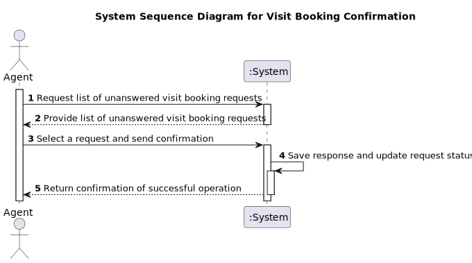
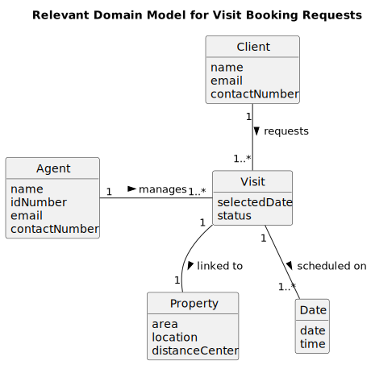
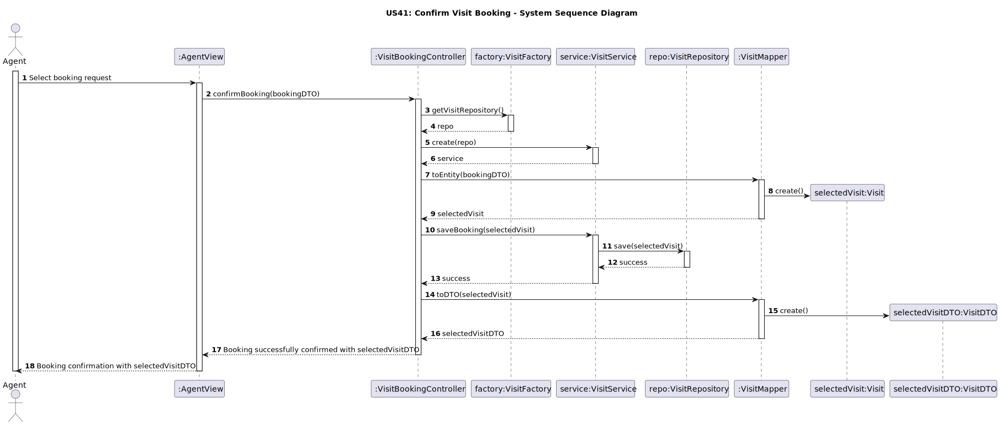
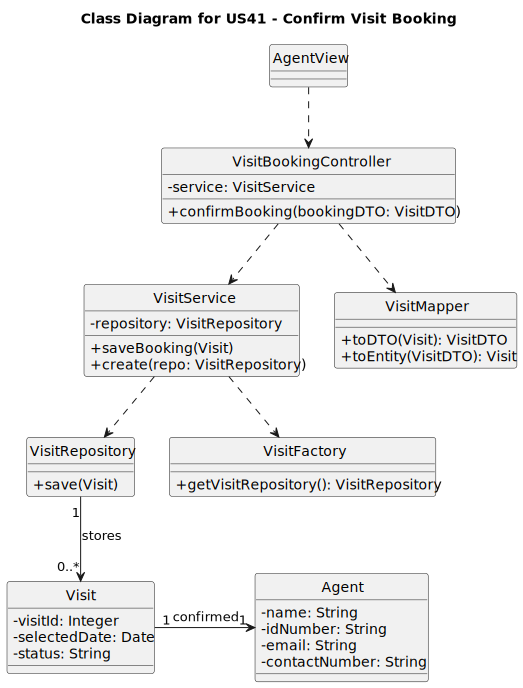

# US41 - Reply to a Visit Booking Request

## 1. Requirements Engineering

### 1.1. User Story Description

As an **Agent**, I want to reply to a visit booking request.

### 1.1. User Story Description

As an **Agent**, I want to reply to a visit booking request so that I can confirm or decline client scheduling requests.

### 1.2. Customer Specifications and Clarifications

**From the specifications document:**

> **Question:** How does the agent select a booking request?
>
> **Answer:** The agent should choose the visit booking request from a list of unanswered requests assigned to them.

> **Question:** Is the agent able to respond to any booking request?
>
> **Answer:** No, the agent can only respond to requests assigned to them.

### 1.3. Acceptance Criteria

- **AC41-1:** The agent must choose the visit booking request from a list of unanswered requests assigned to them.

## 1.4. Found out Dependencies

- **Dependency on Visit Booking Requests System:** The list of requests should include only unanswered requests assigned to the agent.
- **Interaction with Request a Visit Booking (US31-Sprint3):** There must be booking requests made by a **Client**.

- ### 1.5 Input and Output Data

- **Input Data:** Selected booking request (ID) from the list.
- **Output Data:** Confirmation that the response has been registered.

### 1.6. System Sequence Diagram (SSD)

### 1.7 Other Relevant Remarks

- The system should ensure data integrity, allowing responses only for requests assigned to the **logged-in agent**.
- **Performance Constraint:** Must meet a response time of less than 3 seconds for the UI interaction.

## 2. OO Analysis

### 2.1. Relevant Domain Model Excerpt

### 2.2. Other Remarks

- n/a

## 3. Design - User Story Realization

### 3.1. Rationale

| **Interaction ID** | **Question: Which class is responsible for...**                   | **Answer**                   | **Justification (with patterns)**                                                                                                                       |
|--------------------|-------------------------------------------------------------------|------------------------------|---------------------------------------------------------------------------------------------------------------------------------------------------------|
| **Step 1**         | ... interacting with the client and receiving the selected date?  | **ClientView**               | **Pure Fabrication**: The **ClientView** class manages the interaction with the client, allowing the date selection input. |
| **Step 2**         | ... confirming the booking after the date selection?              | **VisitBookingController**   | **Controller**: **VisitBookingController** is responsible for processing the confirmation and ensuring the booking is registered in the system. |
| **Step 3**         | ... confirming the booking after the date selection?              | **VisitBookingController**   | **Controller**: **VisitBookingController** is responsible for processing the confirmation and ensuring the booking is registered in the system. |
| **Step 4**         | ... saving the response and updating the visit request status?    | **VisitBookingController**   | **Controller**: **VisitBookingController** processes the confirmation, ensuring the visit request status is updated. |
| **Step 5**         | ... returning the confirmation of successful operation?          | **VisitBookingController**   | **Controller**: **VisitBookingController** returns the confirmation of successful operation, completing the visit confirmation flow. |

---

### Conceptual Classes Promoted to Software Classes:

- **Date**
- **Property**
- **Visit**
- **Client**

### Other Software Classes (Pure Fabrication) Identified:

- **VisitFactory**
- **VisitRepository**
- **VisitService**
- **ClientView**
- **VisitMapper**
- **VisitBookingController**

### 3.2. Sequence Diagram (SD)

### 3.3. Class Diagram (CD)

**Note: private methods were omitted.**

## 4. Tests

_In this section, it is suggested to systematize how the tests were designed to allow a correct measurement of requirements fulfilling._

**_DO NOT COPY ALL DEVELOPED TESTS HERE_**

**Test 1:** Check that it is not possible to create an instance of the Example class with empty values.

    class ExampleFixture : public ::testing::Test {
        TEST_F(ExampleFixture, CreateWithEmptyCode){
            EXPECT_THROW(new Example(L"",L"Example One"),std::invalid_argument);
        }
    }

_It is also recommended organizing this content by subsections._

## 5. Integration and Demo

_In this section, it is suggested to describe the efforts made to integrate this functionality with the other features of the system._

## 6. Observations

_In this section, it is suggested to present a critical perspective on the developed work, pointing, for example, to other alternatives and or future related work._