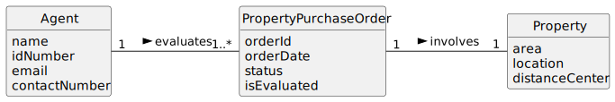

# US 42 - As Agent, I want to evaluate a property purchase/lease order.

## 1. Requirements Engineering

_In this section, it is suggested to capture the User Story description and the requirements specification as provided by the client, as well as any further clarifications on it. It is also suggested to capture the client acceptance criteria and existing dependencies to other requirements. Finally, identify the involved input and output data and depict an Actor-System interaction in order to fulfill the requirements._

### 1.1. User Story Description

The agent should choose the property purchase/lease order from a list of orders
assigned to him and that have not yet been evaluated.

### 1.2. Customer Specifications and Clarifications 

- The list of orders should only include those that are assigned to the logged-in agent.
- The orders displayed should only be those that have not been evaluated yet.
- The agent must be able to select an order from the list.
- The system should update the order’s status to “evaluated” once the agent submits the evaluation.
- If the agent attempts to evaluate an already evaluated order, an error message should be displayed.

### 1.3. Acceptance Criteria

AC42-1: The agent should choose the property purchase/lease order from a list of orders
assigned to him and that have not yet been evaluated.

### 1.4. Found out Dependencies

- There is a dependency on the `OrderRepository` for retrieving and updating the orders.
- There is a dependency on the `OrderService` to handle the logic of order evaluation.

### 1.5 Input and Output Data

- **Input Data**:
    - Order ID (selected from the list of assigned orders).
    - Evaluation status (feedback on the order’s evaluation).

- **Output Data**:
    - A list of orders assigned to the agent that need evaluation.
    - Order details to be displayed to the agent for evaluation.
    - Evaluation confirmation after the agent evaluates the order.

### 1.6. System Sequence Diagram (SSD)

_Insert here a SSD depicting the envisioned Actor-System interactions and throughout which data is inputted and outputted to fulfill the requirements. All interactions must be numbered._

### 1.7 Other Relevant Remarks

- The agent can evaluate multiple orders, but only the orders assigned to them and that have not been previously evaluated are eligible for evaluation.
- The evaluation process will update the order’s status to reflect whether it has been evaluated.

## 2. OO Analysis

### 2.1. Relevant Domain Model Excerpt

_In this section, it is suggested to present an excerpt of the Domain Model (DM) that is seen as relevant to fulfill the requirements._

### 2.2. Other Remarks

The evaluation feature can be extended to include additional details for orders that need more specific handling, such as different types of evaluation statuses.

## 3. Design - User Story Realization

### 3.1. Rationale

**The rationale grounds on the SSD interactions and the identified input/output data.**

| Interaction ID | Question: Which class is responsible for... | Answer  | Justification (with patterns)  |
|:-------------- |:------------------------------------------ |:------------|:---------------------------- |
| Step 1  		 | Which class is responsible for listing the assigned orders? | `ListOrdersController` | The **Controller** pattern is applied here. This controller manages user requests, coordinates with the service layer to retrieve the orders, and returns the results. |
| Step 2  		 | Which class retrieves the orders for the agent? | `OrderService` | The **Service Layer** pattern is used here. The service layer encapsulates the business logic for retrieving orders, isolating the client from complex data access. |
| Step 3  		 | Which class is responsible for the actual order evaluation? | `OrderService` | The **Service Layer** pattern is again applied. The service layer handles the logic for the evaluation process and updates the order status based on the agent’s evaluation. |
| Step 4  		 | Where is the status of the order updated after evaluation? | `OrderRepository` | The **Repository** pattern is used here. The repository abstracts the data access and provides an interface to persist and retrieve orders, in this case, updating the order status. |
| Step 5  		 | Which class confirms that the order has been evaluated successfully? | `OrderService` | The **Service Layer** pattern continues. The service layer processes the evaluation and sends feedback to the controller, confirming that the order has been evaluated. |
| Step 6  		 | Which class handles the display of the evaluation result? | `ListOrdersView` | The **View** pattern is applied. The view is responsible for presenting data to the agent, in this case, displaying the evaluation result received from the controller. |

### Systematization ##

According to the taken rationale, the conceptual classes promoted to software classes are:

- `ListOrdersController`
- `OrderService`
- `OrderRepository`
- `OrderMapper`

Other software classes (i.e. Pure Fabrication) identified:

- `ListOrdersView`
- `OrderRepositoryFactory`
- `OrderListDTO`
- `OrderDTO`

### 3.2. Sequence Diagram (SD)

_In this section, it is suggested to present an UML dynamic view representing the sequence of interactions between software objects that allows to fulfill the requirements._

### 3.3. Class Diagram (CD)

_In this section, it is suggested to present an UML static view representing the main related software classes that are involved in fulfilling the requirements as well as their relations, attributes and methods._

## 4. Tests

_In this section, it is suggested to systematize how the tests were designed to allow a correct measurement of requirements fulfilling._

**_DO NOT COPY ALL DEVELOPED TESTS HERE_**

**Test 1:** Check that it is not possible to create an instance of the Order class with invalid or missing details.

    class OrderFixture : public ::testing::Test {
        TEST_F(OrderFixture, CreateWithMissingDetails){
            EXPECT_THROW(new Order(L"", "", "", ""),std::invalid_argument);
        }
    }

**Test 2:** Check that the order evaluation status is updated correctly after the agent evaluates an order.

    class EvaluationFixture : public ::testing::Test {
        TEST_F(EvaluationFixture, EvaluateOrderSuccessfully){
            EXPECT_TRUE(orderService.evaluateOrder(orderId, true));
        }
    }

_It is also recommended organizing this content by subsections._

## 5. Integration and Demo

_In this section, it is suggested to describe the efforts made to integrate this functionality with the other features of the system._

## 6. Observations

_In this section, it is suggested to present a critical perspective on the developed work, pointing, for example, to other alternatives and or future related work._