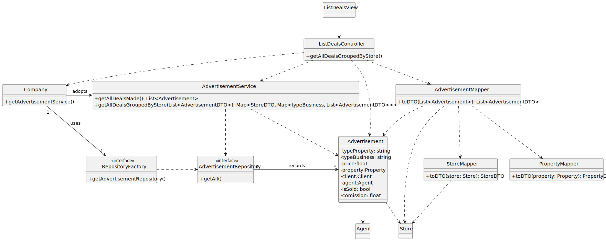

# US 50 - List all deals made.
## 1. Requirements Engineering

### 1.1. User Story Description

As Network Manager, I want to list all deals made.

### 1.2. Customer Specifications and Clarifications

**From the specifications document:**

> **n/a**

**From the client clarifications:**

> **Question:** Should the displayed made deals be the ones in a determined period of time or should all be included since the creation of the store?
>
> **Answer:** All deals made by the Company should be considered.

### 1.3. Acceptance Criteria

- AC50-1: The deals made should be listed store by store, and the total revenue per store must be displayed, separated by type of business (sales and rentals).

### 1.4. Found out Dependencies

- No dependencies were found

### 1.5. Input and Output Data

**Input Data:**

- Typed data:
    - none

- Selected data:
    - none

**Output Data:**

- List of all deals made

### 1.6. System Sequence Diagram (SSD)

### 1.7. Other Relevant Remarks

- Nothing to report for now.

## 2. OO Analysis

### 2.1. Relevant Domain Model Excerpt

### 2.2. Other Remarks

- n/a

## 3. Design - User Story Realization

### 3.1. Rationale

| Interaction ID | Question: Which class is responsible for...                               | Answer                                           | Justification (with patterns)                                                                                                                                                                                                                |
|:---------------|:--------------------------------------------------------------------------|:-------------------------------------------------|:---------------------------------------------------------------------------------------------------------------------------------------------------------------------------------------------------------------------------------------------|
| Step 1  		     | 	... interacting with the actor?                                          | ListDealsView                                    | Pure Fabrication: there is no reason to assign this responsibility to any existing class in the Domain Model.                                                                                                                                |
| 			  		        | 	... coordinating the US?                                                 | ListDealsController                              | Controller                                                                                                                                                                                                                                   |
| 			  		        | 	... knowing all Advertisements?                                          | Company                                          | IE: Company knows all its advertisements.                                                                                                                                                                                                    |
| 			  		        | 	                                                                         | AdvertisementRepository                          | By applying High Cohesion (HC) + Low Coupling (LC) on class Company, it delegates the responsibility on AdvertisementContainer, however by also applying the Repository Pattern, it delegates the responsibility on AdvertisementRepository. |
| 			  		        | ... knowing the AdvertisementRepository?                                  | AdvertisementService                             | By applying High Cohesion (HC) + Low Coupling (LC) on class AdvertisementRepository, it delegates business responsibilities on AdvertisementService, while the AdvertisementRepository has persistence responsibilities.                     |
| 		             | 	... saving repository instances?				                                     | RepositoryFactory                                | Factory method pattern                                                                                                                                                                                                                       |
| 		             | 	... knowing Advertisement data?				                                      | Advertisement                                    | IE: The Advertisement class represents one advertisement, and holds the data for it.                                                                                                                                                         |
| 		             | 	... knowing the Store?                                                   | Agent                                            | IE: The agent class has a stor attribute which represents the store which they currently work for.                                                                                                                                           |  | | 
|   		           | 	... converting Store, Property and Advertisement model objects into DTO? | StoreMapper, PropertyMapper, AdvertisementMapper | DTO pattern.                                                                                                                                                                                                                                 |  | | 
| Step 2  		     | 	... listing all deals?                                                   | ListDealsView                                    | IE: is responsible for user interactions.                                                                                                                                                                                                    |  | | 

### Systematization

According to the taken rationale, the conceptual classes promoted to software classes are:

- Advertisement
- Company
- Agent

Other software classes (i.e. Pure Fabrication) identified:

- ListDealsView
- ListDealsController
- AdvertisementService
- RepositoryFactory
- PropertyService
- StoreMapper
- PropertyMapper
- AdvertisementMapper
- AdvertisementRepository

### 3.2. Sequence Diagram (SD)

### 3.3. Class Diagram (CD)

**Note: private methods were omitted.**

## 4. Tests

No tests were done

## 5. Implementation

A menu option on the console application was added. If the user is a Network Manager he will be able to choose that option
which will take him to the ListDealsView.

    int AuthMenuView::processMenuOption(int option) {
      int result = 0;
      BaseView *view;
      switch (option) {
        case 1:
          if(this->userToken == L"Unregistered"){
            view = new DisplayListedPropertiesView(); // Open DisplayListedPropertiesView
            view->show();
            break;
          }
          if(this->userToken == L"Client"){
            view = new ListPropertyView();
            view->show();
            break;
          }
          if(this->userToken == L"SysAdmin") {
            view = new RegisterStoreView();
            view->show();
            break;
          }
          if(this->userToken==L"NetManager"){
            view = new ListDealsView();
            view->show();
            break;
          }
        case 2:
            if(this->userToken==L"SysAdmin"){
                view = new RegisterAgentView();
                view->show();
                break;
            }
        default:
            result=-1;
            break;
      }
      return result;
    }

## 6. Observations

n/a